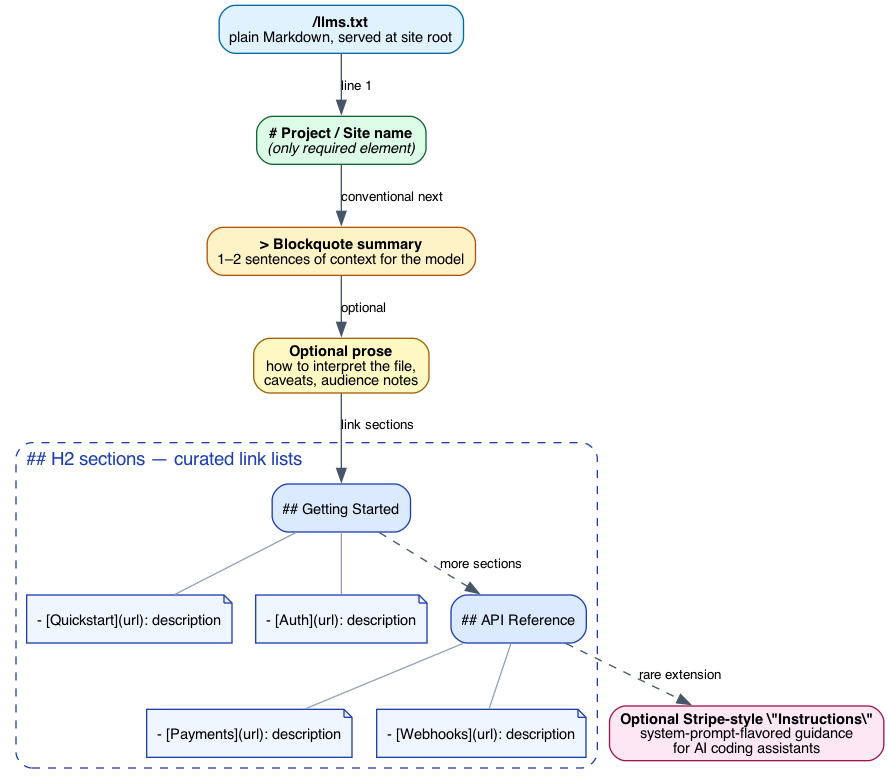
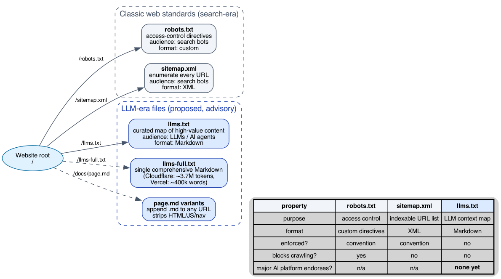

# llms.txt Deep Dive: Design Rationale and Critique

This is the companion to [`what-is-llms-txt.md`](what-is-llms-txt.md). The introduction tells you *what* `llms.txt` is and *who* uses it. This document examines *why* the format looks the way it does, the design choices Jeremy Howard made, and the gap between what advocates claim and what the data shows.

***

## 1. The format, structurally

The proposed structure is intentionally minimal:

- **`# H1`** — project or site name. **Only required element.**
- **`> Blockquote`** — 1–2 sentence summary, intended as primary context for the model.
- **Optional prose** — caveats, audience notes, how to interpret the file.
- **`## H2` sections** — curated lists of links, each `- [Title](url): one-line description`.

That's it. Nothing else is structurally required. The minimalism is not laziness — it's the central design choice and the source of every downstream tradeoff.

### Why Markdown, not XML or JSON?

Howard's stated motivation: *LLMs natively read Markdown.* A model handed XML must reason about element nesting; given JSON, it parses key-value structure. Given Markdown, it does what it does best — read prose with light structure. The format is a **deliberate concession to model-friendliness over machine-strictness**.

This is a meaningful contrast with `sitemap.xml` (machine-parseable, agnostic to readers' cognitive model) and `robots.txt` (custom DSL, terse, directive-style). `llms.txt` accepts that the consumer is increasingly an LLM, not a deterministic crawler, and optimizes accordingly.

### Why only H1 is required

Every other element is optional. This lets adopters start trivially (`# My Site` and stop) and grow incrementally without a migration. It also means parsers can't reject "malformed" files — anything that's a Markdown document with an H1 is technically valid.

The downside: zero schema enforcement. Two `llms.txt` files at different sites may not look anything like each other beyond the H1, which limits what aggregators or AI platforms can reliably do with them at scale.

### The "instructions section" — Stripe's innovation

The spec doesn't define an `## Instructions` section. Stripe added one anyway, and it's qualitatively different from everything else: it functions like a **system-prompt fragment** that shapes how AI coding assistants describe and recommend Stripe's products when developers ask for payment-integration advice.

This expands `llms.txt` from "content map" to "behavior-shaping document." A site can essentially say *"when an LLM is asked about us, this is what it should know first."* The format, being free-form Markdown, accommodates this without changes — but it's also a wedge into territory that overlaps with prompt injection if AI platforms ever do start reading these files in production sessions.

***

## 2. Why companion files exist

The single-file format runs into a tension immediately: documentation sites want a comprehensive AI-readable export *and* a curated index. The proposal handles this with two companion conventions:

- **`llms-full.txt`** — single Markdown file containing all documentation. Cloudflare's runs ~3.7M tokens; Vercel's is described as a 400,000-word novel. The intent: an LLM agent that wants to "RAG over your docs" gets one fetch.
- **`page.md` variants** — append `.md` to any URL to get a clean Markdown version of that page, stripped of HTML/JS/navigation.

Together these address three different consumption patterns:

1. **High-level orientation**: read `llms.txt` (cheap, ~few KB).
2. **Comprehensive ingestion**: read `llms-full.txt` (one round-trip, large payload).
3. **Per-page focused reading**: read individual `.md` variants on demand.

None of this is enforced; conventions vary by adopter.

***

## 3. How it differs from `robots.txt` and `sitemap.xml`

The classic web standards solve different problems and aim at different audiences:

| | `robots.txt` | `sitemap.xml` | `llms.txt` |
|---|---|---|---|
| **Purpose** | Access control | URL enumeration | LLM context map |
| **Audience** | Search engine bots | Search engine bots | LLMs / AI agents |
| **Format** | Custom directives | XML | Markdown |
| **Enforcement** | Convention | Convention | None |
| **Blocks crawling** | Yes | No | No |
| **Curated or exhaustive** | Pattern-based | Exhaustive | Curated |
| **Endorsed by major AI platforms** | n/a | n/a | **None yet** |

The fundamental difference: `llms.txt` is **curated, advisory, and unenforced**. Where `sitemap.xml` aims to enumerate every URL, `llms.txt` is meant to be a short list of high-value content with descriptive context. Where `robots.txt` blocks access, `llms.txt` doesn't restrict anything.

***

## 4. The efficacy gap

The honest summary, derived from public research:

- **OpenAI, Google, and Anthropic have not formally endorsed reading `llms.txt`**. Howard himself does not host one.
- An SE Ranking study of ~300,000 domains found **no measurable correlation** between having `llms.txt` and being cited in AI answers; their XGBoost regression's predictions actually *improved* when the variable was dropped.
- Server-log analyses across multiple sites show **AI crawlers rarely fetch the file**.
- Google's AI Overviews documentation makes no mention of it; OpenAI's crawler docs focus on `robots.txt`.

This produces a paradox the introduction notes: implementation is rising fast (BuiltWith tracked 844k+ sites by Oct 2025; Mintlify-hosted docs added it almost universally), but there's no documented mechanism by which it improves AI visibility.

The "adopt it anyway" arguments are real but limited:

- **Cost is near-zero** if your docs platform generates it automatically.
- **Some AI agent workflows do read it** — Stripe's instructions section influences AI coding assistants today, even if no major AI search citation system pays attention.
- **Future-proofing** — if AI platforms do formally adopt it, early adopters benefit.
- **The act of curation** has standalone value: a thoughtful `llms.txt` forces a site to articulate what's actually important, which improves any LLM's chances of using the site well even via other paths.

What `llms.txt` is **not** doing, despite the marketing: measurably moving AI citations or referral traffic beyond what content quality and structured data already drive.

***

## 5. Why `llms.txt` and MCP are different things

These two specs sometimes get conflated because both are positioned as "how AI talks to your stuff." They are not similar:

| | `llms.txt` | MCP |
|---|---|---|
| **What it is** | A static Markdown file | A bidirectional runtime protocol |
| **Format** | Markdown | JSON-RPC 2.0 |
| **Lifetime** | Read once per session (if at all) | Persistent connection with capability negotiation |
| **Direction** | Site → model (one-way) | Client ↔ Server (bidirectional) |
| **Effect on the world** | None — informational | Tools execute, resources mutate, samples generate |
| **Trust model** | None — convention | Capability-based, host-mediated, isolated |
| **Standardization body** | Independent proposal (Howard) | Linux Foundation / Agentic AI Foundation |
| **Endorsement** | None from major platforms | Adopted by Anthropic, OpenAI, Google, Microsoft, etc. |

A useful framing: **`llms.txt` is a hint to a reader. MCP is a wire protocol for an actor.** They could coexist (an MCP server could expose its `llms.txt` as a resource, for example) but they answer different questions.

***

## 6. What would change the picture

For `llms.txt` to become more than an aspirational standard, several things would need to happen:

1. **A major LLM platform formally documents reading the file.** OpenAI publishing "we fetch `llms.txt` and use it as a system-prompt prelude" would make this concrete overnight; without that, the file is best-effort.
2. **A schema beyond H1.** Right now there's no way for a parser to reliably extract sections — sites name their `##` headings differently. A loose convention (e.g., recommended section names: `## Documentation`, `## API Reference`, `## Examples`) would let aggregators index it.
3. **Trust signals.** No part of `llms.txt` lets a client verify the file is genuine or up-to-date. A signature mechanism, even a simple HTTPS-anchored one, would be needed before AI platforms could weigh `llms.txt` content as authoritative against general web content.
4. **An efficacy story that survives controlled experiments.** As of early 2026, there isn't one.

***

## 7. References

- **Original proposal**: Jeremy Howard, *llms.txt: a proposal*, Answer.AI blog, September 2024.
- **Mintlify automatic generation**: announced November 2024; the largest single accelerant of adoption.
- **SE Ranking study** (~300k domains, XGBoost analysis): no significant correlation found between `llms.txt` presence and AI citations.
- **BuiltWith tracker**: 844k+ websites implementing `llms.txt` as of October 2025.
- **Stripe's `llms.txt`**: notable for its `## Instructions` section; functions as system-prompt-flavored guidance for AI coding assistants.

For a discussion of MCP, the protocol that occupies the runtime space `llms.txt` does not, see [`what-is-mcp.md`](what-is-mcp.md) and [`mcp-deep-dive.md`](mcp-deep-dive.md).
