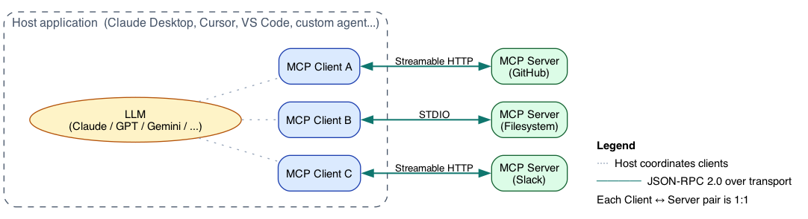
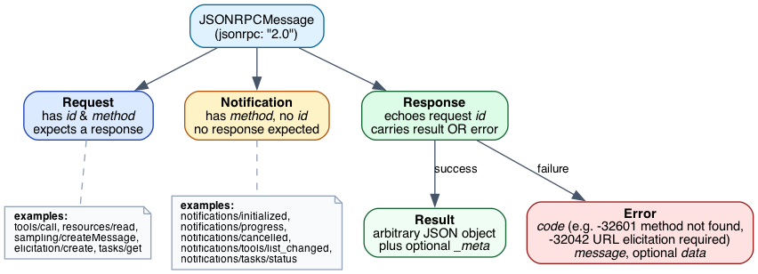
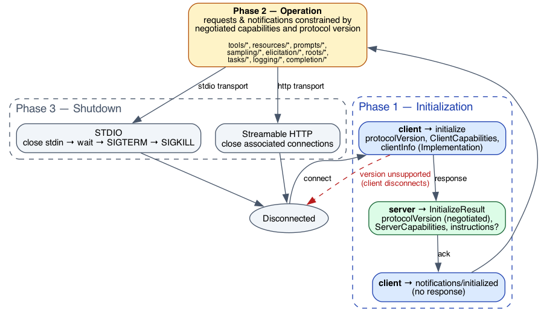
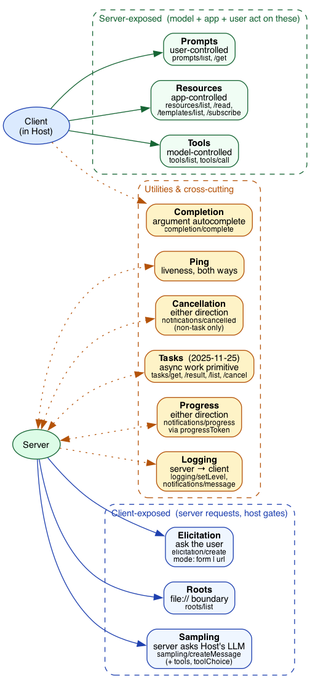
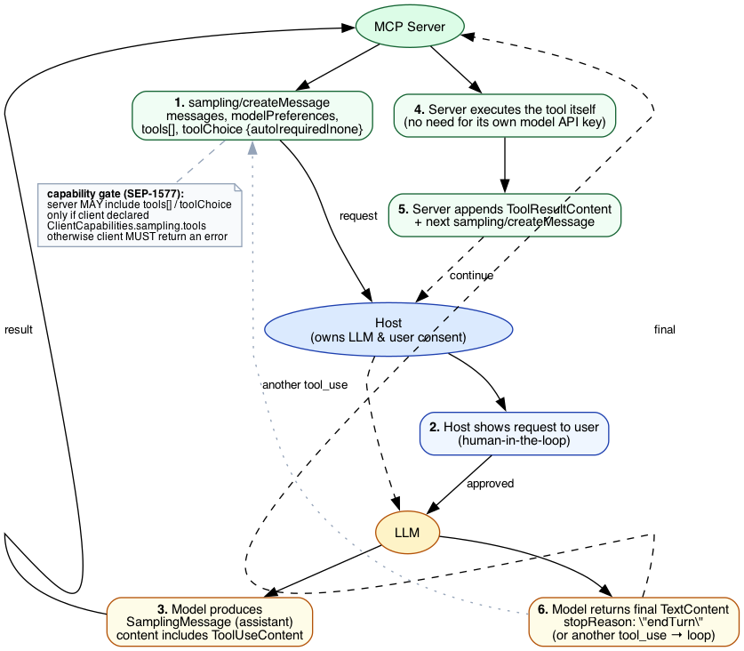
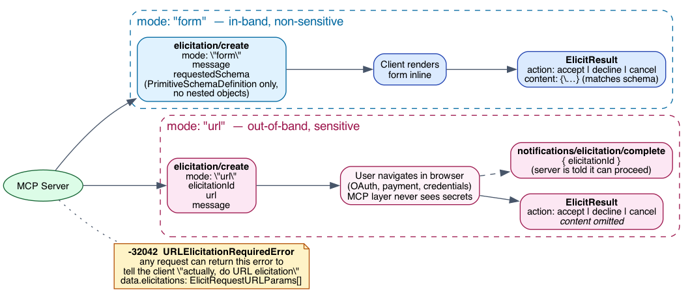
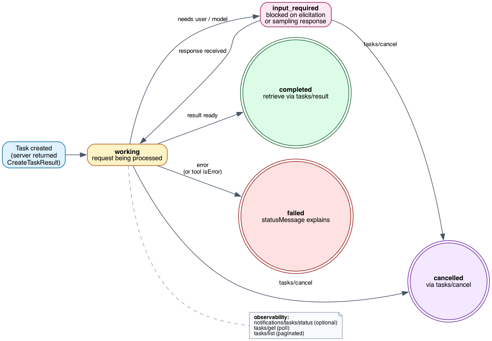

# MCP Deep Dive: Why the Schema Looks the Way It Does

This is the companion to [`what-is-mcp.md`](what-is-mcp.md). The introduction tells you *what* MCP is. This document explains *why* each part of the schema exists, what problem each addition was designed to solve, and the trade-offs the maintainers chose.

Every claim here is anchored to a file in our `modules/modelcontextprotocol/` submodule — the canonical spec is the source of truth. SEP citations link to the proposal that introduced each feature; the SEP itself usually contains the most candid problem statement, often quoted verbatim.

***

## How to read this document

Sections are organized by **layer**, not by SEP number:

1. **Architecture and isolation** — the rules of the protocol's universe.
2. **Wire format** — JSON-RPC, message types, error model.
3. **Lifecycle** — initialize, operate, shutdown.
4. **The six primitives** — Tools, Resources, Prompts, Sampling, Roots, Elicitation.
5. **Tasks** — the async work primitive.
6. **Cross-cutting** — `_meta`, pagination, progress, logging.
7. **Transport** — STDIO and Streamable HTTP.
8. **Authentication and authorization**.
9. **Extensions, governance, and tiering**.

Each section links to the schema definition (TypeScript is the source of truth: `modules/modelcontextprotocol/schema/2025-11-25/schema.ts`) and to the SEP(s) that shaped it.

***

## 1. Architecture and isolation

The architecture is **client-host-server** over JSON-RPC. The Host is the application that owns the LLM and user trust (Claude Desktop, Cursor, custom agent). It coordinates one or more Clients; each Client maintains a **1:1 connection** with a single Server.

The four design principles are stated almost as commandments in `modules/modelcontextprotocol/docs/specification/2025-11-25/architecture/index.mdx`:

> "Servers should be extremely easy to build."
>
> "Servers should be highly composable."
>
> "Servers should not be able to read the whole conversation, nor 'see into' other servers."
>
> "Features can be added to servers and clients progressively."

The third principle — isolation — drives most of the rest of the protocol's shape:

- **A Client connects to exactly one Server.** Cross-server effects are mediated by the Host, never by the Servers themselves. This is why a single Host can safely connect a banking server and a code-execution server in the same session: neither sees the other.
- **Servers don't see the conversation.** Servers receive only the inputs the Host chooses to send (tool arguments, sampling messages, elicitation responses). Full chat history stays in the Host.
- **Capability negotiation is explicit at startup**, not implicit per-call. The Host knows up front whether each Server can do, say, sampling-with-tools, before any tool runs.

These constraints are why the protocol can be both extensible (Servers add new tools freely) and secure (a malicious Server can't snoop on or impersonate another).

***

## 2. Wire format: JSON-RPC 2.0

MCP uses **JSON-RPC 2.0** — UTF-8 encoded, three message shapes only: `Request`, `Response` (`Result` or `Error`), `Notification`. See `schema.ts` lines 8–172 for the canonical definitions.

The choice of JSON-RPC over a bespoke protocol is utilitarian: it's the simplest stateful RPC standard with broad implementation, easy to layer over both a pipe (STDIO) and HTTP. **SEP-1319** later refactored the spec to decouple payload definitions from the RPC method definitions (e.g., `CallToolRequestParams` is a standalone type referenced by `CallToolRequest`) so that future transport bindings — gRPC, Protocol Buffers — can reuse the data layer without rewriting it. The wire format itself is unchanged.

### Two error models, deliberately

A subtle but consequential choice: tool errors are **not** JSON-RPC errors. From `schema.ts`:

> "Any errors that originate from the tool SHOULD be reported inside the result object, with `isError` set to true, _not_ as an MCP protocol-level error response. Otherwise, the LLM would not be able to see that an error occurred and self-correct." (`schema.ts:1117–1131`)

In other words: protocol-level errors (no such tool, malformed message, capability not negotiated) escape as JSON-RPC `error` objects and are caught by the client app. Tool-execution errors stay **inside the conversation as data** so the model can read them and try again. **SEP-1303** later codified that input validation errors fall into the second category specifically — when a tool's `inputSchema` rejects an argument, return an `isError: true` `CallToolResult` rather than an `INVALID_PARAMS` JSON-RPC error, so the model can correct itself.

### `_meta`: the universal extension point

Almost every object in the schema accepts an optional `_meta` field. It's the official place for vendor and protocol extensions to attach data without colliding with future spec fields. **SEP-414** documents OpenTelemetry trace context propagation as the canonical example:

- `_meta.traceparent`, `_meta.tracestate`, `_meta.baggage` (W3C Trace Context standard keys)
- Tasks attach themselves the same way: `_meta["io.modelcontextprotocol/related-task"] = { taskId }`

The convention is **reverse-DNS prefixing** (`io.modelcontextprotocol/...`, `com.example/...`) to keep keyspaces collision-free.

***

## 3. Lifecycle: initialize, operate, shutdown

Defined in `modules/modelcontextprotocol/docs/specification/2025-11-25/basic/lifecycle.mdx`. Three phases:

1. **Initialization** — The client sends `initialize` with its `protocolVersion`, `ClientCapabilities`, and `clientInfo`. The server responds with the **negotiated** `protocolVersion` (which may be older than the client requested), its `ServerCapabilities`, and `serverInfo`. The client sends `notifications/initialized` to confirm. *"The initialization phase MUST be the first interaction between client and server."*
2. **Operation** — Requests and notifications flow, constrained by the negotiated capabilities. Sending a method that wasn't capability-declared is a protocol error.
3. **Shutdown** — Transport-specific. STDIO: close stdin → wait → SIGTERM → SIGKILL. HTTP: close associated connections.

### Capabilities are an open set

Both `ClientCapabilities` and `ServerCapabilities` (`schema.ts:312–459`) reserve an `experimental` namespace and explicitly state: *"any client can define its own, additional capabilities."* This is the gap that **SEP-2133 (Extensions)** later filled with formal governance — see §9 below. Until then, `experimental.*` was the wild west.

Each capability also nests *its own* feature flags:

- `resources: { subscribe?, listChanged? }` — both opt-in. Subscription support is more expensive than just listing, so servers can offer the cheap surface only.
- `tools: { listChanged? }` — only servers that can change their tool set at runtime advertise this.
- `sampling: { context?, tools? }` — added by **SEP-1577**; client signals whether it supports `includeContext` and tool-use-during-sampling. Without these flags, a server *must not* send the corresponding fields.
- `tasks: { list?, cancel?, requests: { tools: { call }, sampling: { createMessage }, elicitation: { create } } }` — added by **SEP-1686**; per-method declaration of which requests can be task-augmented.

The pattern: **capabilities form a hierarchy, and absence means "don't do that thing."**

### One method that's special: `initialize` cannot be cancelled

`schema.ts:240`: *"A client MUST NOT attempt to cancel its `initialize` request."* Cancellation mid-handshake leaves the connection in an undefined state. Everything else can be cancelled via `notifications/cancelled` (or `tasks/cancel` for task-augmented requests).

***

## 4. The six primitives

The MCP spec organizes its functional surface around three primitives the **server** exposes (Tools, Resources, Prompts) and three the **client** exposes (Sampling, Roots, Elicitation). The split mirrors a clean control-flow story documented in `learn/architecture.mdx`:

| Primitive | Direction | Who controls invocation |
|-----------|-----------|-------------------------|
| Tools | Client → Server | **Model** decides to call |
| Resources | Client → Server | **Application** decides what to include |
| Prompts | Client → Server | **User** decides (e.g. slash command) |
| Sampling | Server → Client | **Server** asks Host's LLM for completion |
| Roots | Server → Client | **Server** asks for filesystem boundaries |
| Elicitation | Server → Client | **Server** asks user a question |

Two cross-cutting rules:

1. **Server-to-client requests must be nested in a client-initiated request.** Per **SEP-2260** (Accepted, 2025-11-25): `roots/list`, `sampling/createMessage`, and `elicitation/create` are only valid mid-flight inside a tool call, resource read, or prompt fetch. Standalone server push is forbidden. The exception is `ping`. This simplifies transports (no separate server-push channels needed) and clarifies UX (users see elicitations because they initiated something).
2. **Human-in-the-loop is normative for tools and sampling.** From `server/tools.mdx`: *"there SHOULD always be a human in the loop with the ability to deny tool invocations."* Same wording for sampling.

### 4.1 Tools

Schema: `Tool` interface at `schema.ts:1251`. Methods: `tools/list`, `tools/call`, plus `notifications/tools/list_changed`.

Several things in the `Tool` definition are answers to specific past pain:

- **`inputSchema` and `outputSchema` default to JSON Schema 2020-12.** Before **SEP-1613**, implementations diverged across draft-07 and 2020-12, causing silent validation differences. The spec now defaults explicitly; servers using draft-07 features must declare `$schema` to opt out.
- **`outputSchema` is restricted to `type: "object"` at the root**, which lets the client trust that `structuredContent` is always a JSON object. This pairs with the new `structuredContent` field on `CallToolResult` (`schema.ts:1115`): tools may emit unstructured `content` blocks for the model to read **and** a structured object for the host to consume programmatically.
- **`ToolAnnotations` are explicitly hints, not contracts.** From `schema.ts:1173`: *"NOTE: all properties in ToolAnnotations are hints. They are not guaranteed to provide a faithful description of tool behavior … Clients should never make tool use decisions based on ToolAnnotations received from untrusted servers."* The four flags — `readOnlyHint`, `destructiveHint`, `idempotentHint`, `openWorldHint` — exist for UI affordance ("show this tool with a warning icon"), not as a security gate.
- **`execution.taskSupport: forbidden | optional | required`** lets a tool advertise whether it expects task-augmented execution. A "process this 200MB video" tool can require it; a "what time is it" tool forbids it.
- **Tool names are constrained.** **SEP-986** locked tool names to 1–64 chars, alphanumeric plus `_-./`, case-sensitive. Before this, implementations used inconsistent separators (snake_case, kebab-case, camelCase) and special characters that broke documentation tools.
- **`name` vs `title`.** `BaseMetadata` (`schema.ts:530`) splits programmatic identifier (`name`) from human display (`title`). **SEP-973** added `icons` and `websiteUrl` for richer UI affordance. Why? Without these, every server looked the same in client UIs and users couldn't recognize which provider was running which tool.

### 4.2 Resources

Schema: `Resource` at `schema.ts:804`. Methods: `resources/list`, `resources/read`, `resources/templates/list`, `resources/subscribe`/`unsubscribe`. Notifications: `list_changed`, `updated`.

The notable design choices:

- **URI-keyed.** Any URI scheme works; the server interprets it. This keeps the door open for `file://`, `https://`, `git://`, custom `db://` schemes — without burdening MCP with semantics.
- **`ResourceTemplate` uses RFC 6570 URI templates** (`schema.ts:847`). A server exposing rows in a database doesn't need to enumerate every row; it can declare `repos/{owner}/{repo}/issues/{number}` and let the client construct concrete URIs.
- **Subscriptions are a separate capability.** Many servers offer static read-only resources; supporting `resources/subscribe` requires real-time change tracking. Splitting `subscribe` from `listChanged` lets servers offer the cheap surface only.
- **`size` and `_meta` on `Resource`** let hosts estimate context-window cost before reading.
- **`annotations.priority` (0–1)** is a soft hint — *"how important is this for operating the server"* — that hosts can use to budget which resources to load when context is tight.

### 4.3 Prompts

Schema: `Prompt` at `schema.ts:986`. Methods: `prompts/list`, `prompts/get`, plus `list_changed` notification.

Prompts are the most **user-controlled** primitive: the user explicitly invokes one, often via a slash command. A `prompts/get` returns a `PromptMessage[]` ready to feed to the LLM. The `arguments` slots are templated by the client.

The notable bits:

- **`completion/complete`** (autocomplete) was added so a UI can offer typeahead for prompt arguments and resource template variables. Without it, every host built its own argument-completion logic on top of free-text input.
- **`PromptMessage.content`** can be any `ContentBlock`, including `EmbeddedResource` — letting prompts pull a resource into the conversation as one atomic step.

### 4.4 Sampling

Schema: `CreateMessageRequest` at `schema.ts:1646`. **This is the bidirectional capability** — the server asks the *host's* LLM for a completion. It exists for one reason: to enable agentic patterns inside servers without making each server own its own model API key.

**SEP-1577** (Final, 2025-11-25) extended sampling with `tools[]` and `toolChoice`. Before this, sampling was effectively single-turn. After this, a server can run a complete agent loop:

1. Server: `sampling/createMessage` with `tools: [...]`, `toolChoice: { mode: "auto" }`, and conversation messages.
2. Host shows the user the request (human-in-the-loop), gets approval, runs the model.
3. Model emits `ToolUseContent` (a `tool_use` content block) inside the response.
4. **Server executes the tool itself** — possibly its own tool, possibly via an internal pipeline.
5. Server appends `ToolResultContent` to the conversation and sends another `sampling/createMessage`.
6. Loop until the model returns a `TextContent` with `stopReason: "endTurn"`.

The critical capability gate: a server **must not** include `tools[]` or `toolChoice` unless the client declared `ClientCapabilities.sampling.tools`. The client *must* return an error if it sees these fields without the capability declared (`schema.ts:1614–1623`). This protects clients that don't yet know how to handle tool-use content blocks.

Other sampling design notes:

- **`modelPreferences` are advisory.** From the schema doc-comment: *"These preferences are always advisory. The client MAY ignore them."* A server can hint *"prefer Claude Sonnet"* via `ModelHint.name`, and the client may map it to a similar model from another provider — `ModelHint` doc-comment explicitly suggests `gemini-1.5-flash` could match `claude-3-haiku` if filling a similar niche.
- **`includeContext` is soft-deprecated** unless the client declares `sampling.context`. The spec moves toward "servers explicitly pass the context they need" rather than "ask the host to dump context in."
- **Two-sided human-in-the-loop.** The host is supposed to show the user *both* the sampling request before sending it to the model *and* the model's response before returning it to the server.

### 4.5 Roots

Schema: `Root` at `schema.ts:2122`. Method: `roots/list` (server → client). Notification: `notifications/roots/list_changed` (client → server).

Roots tell a server which filesystem boundaries it can operate on. Currently `file://` URIs only — the schema explicitly notes *"This restriction may be relaxed in future versions of the protocol."* The intent is to extend to cloud namespaces (`s3://`, `gcs://`) without breaking the existing surface.

The simpler-than-you'd-expect design is deliberate. Roots aren't a permission system — clients decide what to expose, and servers *ask* via `roots/list*. The server doesn't enforce anything; it just adapts its behavior. Path traversal protection lives in the client.

### 4.6 Elicitation

Schema: `ElicitRequest` at `schema.ts:2230`. The server asks the user a question mid-flight. There are two modes, and the choice between them is **mandatory** by content type.

**Form mode** (`schema.ts:2161`): in-band, `requestedSchema` restricted to a `PrimitiveSchemaDefinition` — only top-level properties of `string`/`number`/`boolean`/`enum`, no nesting. Why the restriction? *"A restricted subset of JSON Schema. Only top-level properties are allowed, without nesting."* The form is meant to be predictably renderable as a dialog; nesting forces the client into arbitrary form-builder territory.

**URL mode** (`schema.ts:2191`, **SEP-1036**): out-of-band, server sends a URL the user navigates to in their browser. When the user finishes the flow there, the server gets a `notifications/elicitation/complete` with the matching `elicitationId`. The MCP layer never sees the secret.

The spec is explicit that this isn't a UX preference but a **security boundary**:

> "Servers MUST NOT use form mode elicitation to request sensitive information such as passwords, API keys, access tokens, or payment credentials. Servers MUST use URL mode for interactions involving such sensitive information." (`elicitation.mdx`)

To make existing flows easy to upgrade, **SEP-1036** also added a special JSON-RPC error code: `-32042 URLElicitationRequiredError`. Any request can return this error to say *"actually, I need URL elicitation first"* — the error data carries the `ElicitRequestURLParams[]`. This lets a server, mid-tool-call, redirect the user to a browser without restarting the call from scratch.

**SEP-1330** then refined form mode for enums:

- `UntitledSingleSelectEnumSchema` — `{type: "string", enum: [...]}` (plain dropdown).
- `TitledSingleSelectEnumSchema` — `{type: "string", oneOf: [{const, title}, ...]}` (dropdown with display labels).
- `UntitledMultiSelectEnumSchema` and `TitledMultiSelectEnumSchema` — array variants for multi-select.
- The legacy non-standard `enumNames` field is deprecated but still supported.

**SEP-1034** added `default` to `string`/`number`/`enum` schemas (it had been boolean-only). This sounds trivial but matters in practice: pre-filling "reply to" emails or default ports turns "type the obvious value yourself" into "press Enter."

***

## 5. Tasks: the async work primitive

Schema: `Task` at `schema.ts:1346`. Methods: `tasks/get`, `tasks/result`, `tasks/list`, `tasks/cancel`. Notification: `notifications/tasks/status`.

**SEP-1686** (Final, 2025-11-25) introduces the most consequential addition in the latest spec. Before Tasks, MCP had no way to express *"this tool will take 4 hours; let me come back for the result."* You either kept the connection open the entire time (fragile) or refused to wrap such tools at all.

The design choices:

- **Augmentation, not a new RPC type.** A request becomes task-augmented by adding `task: TaskMetadata` to its params (via the `TaskAugmentedRequestParams` mixin, `schema.ts:37`). The server returns a `CreateTaskResult` immediately with a `Task` object containing a `taskId`; the client polls or subscribes for the actual result. This works for *any* request type the server declares as task-augmentable — `tools/call`, `sampling/createMessage`, `elicitation/create`.
- **State machine with five states.** `working` (in flight), `input_required` (blocked on elicitation/sampling), `completed`, `failed`, `cancelled`. The `input_required` state is what makes the model coherent when a long-running task itself needs to ask the user something; it's not just a binary done/not-done.
- **`pollInterval` is server-suggested.** A task can hint how often the client should poll, letting servers smooth their own load.
- **`ttl` is requested by the client and confirmed by the server.** Clients ask for retention via `TaskMetadata.ttl`; the server returns the actual retention in `Task.ttl` (or `null` for unlimited). Servers can downgrade requests they can't honor.
- **Tools self-declare their relationship to tasks** via `Tool.execution.taskSupport: forbidden | optional | required`. A long-running batch tool can require it; a quick lookup forbids it.
- **Cancellation is method-specific.** Non-task requests use `notifications/cancelled`; tasks use `tasks/cancel` (a request, not a notification, so the caller knows it succeeded).

Tasks also enable **resumption across reconnects**: a client can disconnect, reconnect, and call `tasks/list` to find work it had in flight. This pairs with **SEP-1699** (SSE polling via server-side disconnect) to make MCP viable for hour-long jobs over flaky networks.

***

## 6. Cross-cutting features

These don't belong to any single primitive but show up everywhere.

### `_meta` and reverse-DNS keys

Already covered in §2. Used for OTel trace context (**SEP-414**), task association (`io.modelcontextprotocol/related-task`), and any vendor-specific data.

### Pagination

`Cursor` is an opaque string (`schema.ts:30`). All `*/list` methods accept `cursor?` in params and return `nextCursor?` in results. Servers control the cursor semantics — clients must not parse them. This lets servers implement pagination via offset, keyset, or whatever fits their backend, without the protocol caring.

### Progress

`notifications/progress` (`schema.ts:618`). Triggered when a request includes `_meta.progressToken` (an opaque value the caller chooses); the receiver can emit `progress/total/message` updates against that token. Critical for long-running tools that aren't task-augmented.

### Cancellation

Two mechanisms:
- `notifications/cancelled` (with `requestId`) for non-task requests.
- `tasks/cancel` (a request, with `taskId`) for tasks.

The split exists because `notifications/cancelled` is fire-and-forget — you can't know if it arrived. For tasks, you want a confirmed cancel.

### Logging

`logging/setLevel` lets the client throttle a server's `notifications/message` stream. Severity levels follow RFC-5424 (`debug`, `info`, `notice`, `warning`, `error`, `critical`, `alert`, `emergency`) — borrowing from syslog rather than inventing new levels.

### Ping

`ping` request, both directions. Used to detect dead connections; `notifications/cancelled` and `tasks/cancel` can't substitute because they don't carry their own response.

### Completion

`completion/complete` (`schema.ts:2038`) returns autocomplete suggestions for prompt arguments and URI template variables. Capped at 100 values per response with `hasMore` for "there are more options." Optional `context.arguments` lets a server consider previously-resolved variables.

### Icons and BaseMetadata

`Icon` (`schema.ts:466`) supports PNG/JPEG (must), SVG/WebP (should), with `sizes` and `theme` (light/dark). Servers, tools, resources, and prompts all carry `icons[]`. Hosts now show recognizable icons in their UI rather than a wall of generic labels.

***

## 7. Transport

Two transports are defined; both carry the same JSON-RPC. Transport selection is a deployment concern, not a protocol concern.

### STDIO

For local same-process integrations. The host launches the server as a subprocess, writes JSON-RPC messages to stdin, reads from stdout. Messages are newline-delimited (no embedded newlines). `stderr` is reserved for logging — *not* error signaling. The host should not interpret stderr as part of the protocol.

### Streamable HTTP

For remote integrations. The client POSTs requests; the server responds with either:
- A direct JSON response, or
- A `text/event-stream` (SSE) stream that may include the response *and* server-initiated requests/notifications related to the originating request (think: a tool call that does sampling mid-flight).

Two SEPs hardened this transport:

- **SEP-1699 (SSE polling via server-side disconnect)** lets servers close an SSE stream after sending an event with an `id`. Clients reconnect with `Last-Event-ID`. This makes long-running calls survive flaky infrastructure: you don't need to hold a connection open for 4 hours; you process, send `id`, hang up, and the client picks up where it left off.
- **SEP-2243 (HTTP header standardization)** exposes routing info in headers. Without it, every load balancer or WAF had to terminate TLS and parse JSON to make routing decisions. Now `Mcp-Method` and `Mcp-Name` (and optional `Mcp-Param-{Name}` headers tools opt into via `x-mcp-header` in their inputSchema) sit in HTTP headers so standard infrastructure can route, rate-limit, and audit MCP traffic without packet inspection.

***

## 8. Authentication and authorization

The auth story is the area with the most evolution. Each SEP solves a deployment friction the previous round left in place.

| Layer | Problem | SEP | Solution |
|---|---|---|---|
| Resource server discovery | Clients had to parse `WWW-Authenticate` headers; multi-tenant infra struggled to inject them | **SEP-985** | Fall back to `.well-known/oauth-protected-resource` per RFC 9728 |
| Client registration | DCR forces servers to maintain unbounded client DBs; pre-registration is manual | **SEP-991** | Client hosts a JSON metadata document at an HTTPS URL; that URL *is* the `client_id` |
| M2M flows | OAuth code grant requires a human | **SEP-1046** | Add `client_credentials` grant; recommend asymmetric JWT assertions per RFC 7523 |
| Enterprise IdP integration | Enterprises can't enforce policy on which servers users can use | **SEP-990** | ID-JAG (Identity-Granted Access JWT) — exchange an enterprise IdP token for an MCP-specific access token via `/mcp/oauth/authorize` |
| OIDC refresh tokens | Client behavior was inconsistent | **SEP-2207** | Guidance: clients MAY request `offline_access` if AS supports it; servers should not surface `offline_access` in 401 challenges |

The architectural pattern that emerged: **the MCP server is an OAuth Resource Server, not an Authorization Server.** Anything resembling an AS (token issuance, refresh, revocation) is delegated to a real AS — enterprise IdP, Auth0, Okta, or a dedicated MCP AS. This was an explicit shift in the `2025-06-18` spec and remains the architecture in `2025-11-25`.

***

## 9. Extensions, governance, tiering

### Extensions framework — SEP-2133

Before SEP-2133 (Final, 2025-11-25), every "experimental" capability lived under `experimental.*` with no governance. The framework adds:

- **Identifiers**: `{vendor-prefix}/{extension-name}`, e.g. `io.modelcontextprotocol/oauth-client-credentials`. Vendor prefix should be reverse-DNS.
- **Three statuses**: experimental (incubation in `experimental-ext-*` repos, tied to a Working Group), official (stable in `ext-*` repos, evolves independently of core), unofficial (third-party, not governed).
- **Capability declaration** in `ClientCapabilities.extensions[id] = {settings}`. Each extension defines its own settings schema. Both sides must declare to use one.
- **SDKs choose what to implement** — extensions don't count against tier conformance (see SEP-1730 below).

The first official extension, **SEP-1865 (MCP Apps)**, lets servers ship interactive UIs (`ui://` URI scheme, currently HTML-only with iframe sandboxing). Communications between the iframe and host go over the same JSON-RPC, not a custom postMessage protocol.

### Governance — SEP-932, SEP-2085, SEP-2148, SEP-2149, SEP-1850

The governance stack stabilized in late 2025:

- **SEP-932** sets up roles (Contributor → Member → Maintainer → Core Maintainer → Lead Maintainer) and the SEP process.
- **SEP-2148** (Contributor Ladder) gives explicit advancement criteria — 2–3 months for Member, 6+ months for Maintainer, with sponsor requirements.
- **SEP-1302** + **SEP-2149** formalize Working Groups (deliver SEPs, code) and Interest Groups (gather use cases, recommend solutions). Charters are mandatory; existing groups had 8 weeks to adopt them.
- **SEP-2085** documents Lead Maintainer succession (majority vote) and amendment procedures (Core Maintainers, 2/3 vote, 5-day comment).
- **SEP-1850** moved SEPs to PR-based file workflow: each SEP lives at `seps/{PR-NUMBER}-{slug}.md`, the PR number *is* the SEP number, eliminating manual numbering and giving every SEP a built-in discussion thread.

### SDK tiering — SEP-1730

Three tiers with **objective conformance criteria**:

- **Tier 1 (Fully Supported)**: 100% conformance test pass, ack issues in 2 days, fix critical bugs in 7 days, new features before RC-to-release.
- **Tier 2 (Commitment to Tier 1)**: 80% pass, new features within 6 months, published roadmap to Tier 1.
- **Tier 3 (Experimental)**: no guarantees.

Auto-relegation if compliance fails or issues stagnate. SDK badges show conformance percentage. The intent is to let users see, at a glance, whether a Python or Go or Ruby SDK is production-ready — and to push SDKs toward harmonization rather than each implementing its own subset.

***

## 10. Spec versioning

MCP uses **date-stamped** versions, not semver. Every protocol change is documented in a SEP. The active versions are:

| Version | Status | Anchored by |
|---------|--------|-------------|
| `2024-11-05` | Legacy | First stable release |
| `2025-03-26` | Legacy | Intermediate stable |
| `2025-06-18` | Stable | OAuth as Resource Server (RFC 9728), Resource Indicators (RFC 8707), Elicitation, Resource Links |
| `2025-11-25` | Latest | Tasks (SEP-1686), Sampling-with-Tools (SEP-1577), URL Elicitation (SEP-1036), Client Credentials (SEP-1046), Enterprise IdP (SEP-990), HTTP Headers (SEP-2243), SSE Polling (SEP-1699), Extensions (SEP-2133), MCP Apps (SEP-1865), JSON Schema 2020-12 default (SEP-1613), HTTP & governance hardening |
| `draft` | In progress | See `modules/modelcontextprotocol/docs/specification/draft/` |

Clients send their latest supported version on `initialize`; servers respond with what they want to use (which may be older). If the client can't support the server's choice, it disconnects.

***

## 11. References

All paths relative to `modules/modelcontextprotocol/`.

- **Schema (source of truth)**: `schema/2025-11-25/schema.ts`
- **Architecture spec**: `docs/specification/2025-11-25/architecture/index.mdx`
- **Lifecycle spec**: `docs/specification/2025-11-25/basic/lifecycle.mdx`
- **Transports spec**: `docs/specification/2025-11-25/basic/transports.mdx`
- **Authorization spec**: `docs/specification/2025-11-25/basic/authorization.mdx`
- **Tools spec**: `docs/specification/2025-11-25/server/tools.mdx`
- **Resources spec**: `docs/specification/2025-11-25/server/resources.mdx`
- **Prompts spec**: `docs/specification/2025-11-25/server/prompts.mdx`
- **Sampling spec**: `docs/specification/2025-11-25/client/sampling.mdx`
- **Roots spec**: `docs/specification/2025-11-25/client/roots.mdx`
- **Elicitation spec**: `docs/specification/2025-11-25/client/elicitation.mdx`
- **Tasks spec**: `docs/specification/2025-11-25/basic/utilities/tasks.mdx`
- **Conceptual overview**: `docs/docs/learn/architecture.mdx`
- **All SEPs**: `seps/`
- **Extensions overview**: `docs/extensions/overview.mdx`
- **Registry**: `docs/registry/about.mdx`
