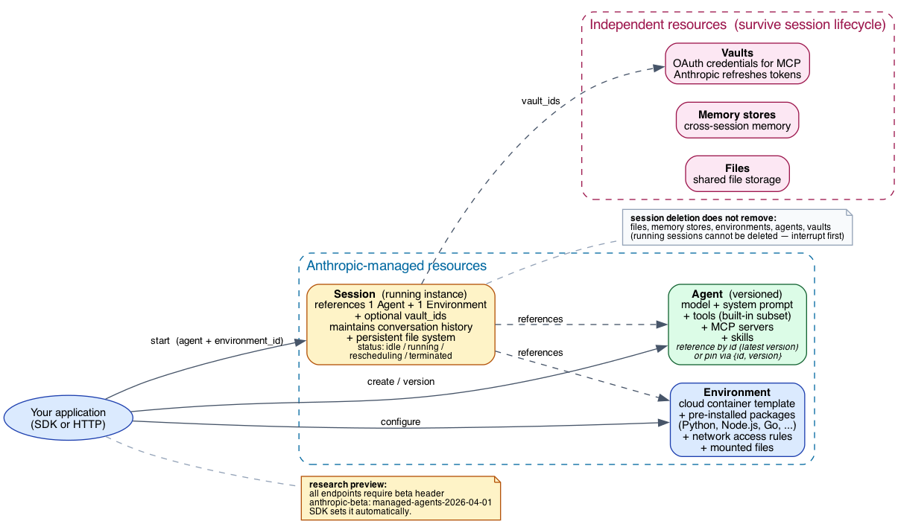
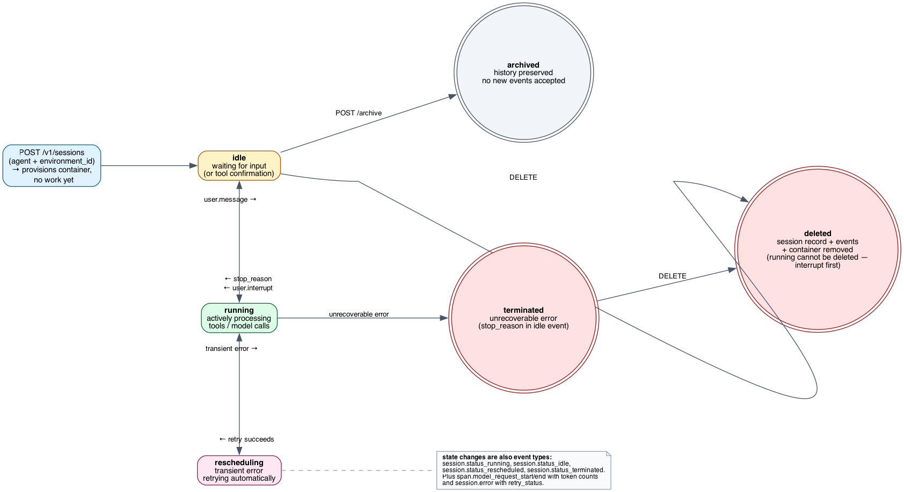
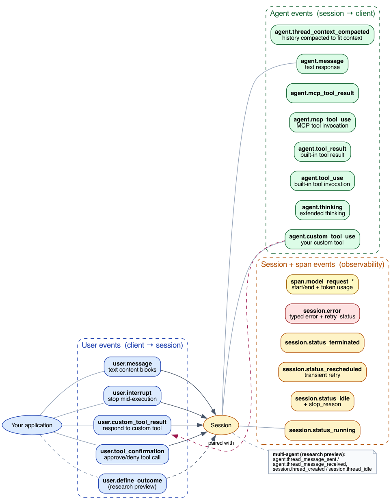
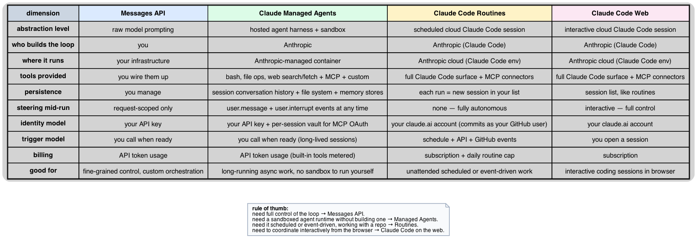

# Managed Agents Deep Dive: Why the Surface Looks the Way It Does

This is the companion to [`what-is-managed-agents.md`](what-is-managed-agents.md). The introduction tells you *what* the resources are and how the lifecycle works. This document examines *why* the surface is shaped this way — the deliberate split between the Messages API and Managed Agents, the four-resource model, the bidirectional event stream, the survival semantics for files and memory, and the gap between Managed Agents and adjacent products like Routines.

There is no upstream submodule for the Anthropic Platform; claims here anchor to the official docs at <https://platform.claude.com/docs/en/managed-agents/>. Where this topic intersects MCP — connectors, vaults, the OAuth flow — the relevant cross-references point into our `modules/modelcontextprotocol/` material and into the existing MCP deep-dive.

***

## How to read this document

Sections are organized by design dimension:

1. **The four-resource model** — why Agent, Environment, Session, Events are separate.
2. **Session lifecycle and statuses** — what the state machine encodes.
3. **The event model** — bidirectional, named, queued.
4. **Tools and the harness** — what's built-in vs custom vs MCP.
5. **MCP integration via vaults** — token refresh as a managed concern.
6. **Persistence model** — why files, memory stores, and vaults outlive sessions.
7. **Comparison with adjacent products** — Messages API, Routines, Claude Code on the web.
8. **Beta semantics and what's likely to change.**
9. **References.**

***

## 1. The four-resource model: why split Agent / Environment / Session / Events

The most consequential design choice in Managed Agents is the four-resource split. From the overview:[1]

> "Claude Managed Agents is built around four concepts: **Agent** … **Environment** … **Session** … **Events**."

Each resource carries a different lifecycle expectation:

- **Agent** is a *configuration* that includes the model, system prompt, tool list, MCP servers, and skills. Agents are **versioned** — you can pin a session to a specific version, allowing staged rollouts of new prompts without affecting in-flight sessions.[2]
- **Environment** is a *container template* — pre-installed packages, network access rules, mounted files. Environments are configured once and shared across many sessions.[1]
- **Session** is a *running instance* — references one Agent and one Environment, plus optional `vault_ids` for MCP OAuth. The session owns the in-flight conversation history and the persistent file system for that run.[2]
- **Events** are the *messages* exchanged between your app and the agent.[3]

The split mirrors the operational model of containerized applications more than the model of a chat session. Agent ↔ Container Image. Environment ↔ Pod template. Session ↔ Running pod. The natural lifecycle relationships fall out of that mental model: you can update an agent without disturbing running sessions; you can spin up many sessions from the same agent + environment; you can delete one session without losing your file storage.

### Why agents are versioned

Versioning is built into the agent resource:[2]

> "Agents are versioned resources; passing in the `agent` ID as a string starts the session with the latest agent version. To pin a session to a specific agent version, pass an object. This lets you control exactly which version runs and stage rollouts of new versions independently."

Without versioning, every system-prompt change would silently re-shape every running session — an obvious correctness hazard for long-running tasks. With versioning, the API explicitly forces a choice: "do I want my running session to track the latest, or do I want it pinned?" Pinning is the safe default for production workloads; latest-tracking is convenient for development.

### Why session creation doesn't start work

A subtle but important detail:[2]

> "Creating a session provisions the environment and agent but does not start any work. To delegate a task, send events to the session using a user event."

This separates *resource provisioning* from *task initiation*. You can:

- Create a pool of warm sessions that don't yet have a task (useful for latency-sensitive applications).
- Inspect the session before sending the first user event.
- Make session creation idempotent in your control plane — retrying creation never re-runs a task.
- Send the first `user.message` once you've validated everything else is wired up.

Compared to a "send a single payload, get one response" API like Messages, this is a meaningful operational improvement for production systems.

***

## 2. Session lifecycle: a state machine, not a single call

Sessions move through four statuses, exposed both via `GET /v1/sessions/{id}` and via `session.status_*` events:[2][3]

| Status | Meaning |
|--------|---------|
| `idle` | Waiting for input — user message or tool confirmation. New sessions start here.[2] |
| `running` | Actively executing tools / model calls.[2] |
| `rescheduling` | Transient error; harness is retrying automatically.[2] |
| `terminated` | Ended due to an unrecoverable error.[2] |

Two operational verbs sit alongside the state machine:[2]

- **Archive** preserves the session's history but stops new events. Useful for long-term audit retention without keeping a live container around.
- **Delete** permanently removes the session record, its events, and its container. Files, memory stores, environments, agents, and vaults are *not* affected — they are independent resources.[2]

A safety rail: *"A `running` session cannot be deleted; send an interrupt event if you need to delete it immediately."*[2] This prevents the foot-gun of a delete that races with active model inference and leaves an inconsistent observability trail.

### `rescheduling` is interesting

Most managed-state APIs hide retry behavior. Managed Agents surfaces it as a status:[2]

> "`rescheduling` — Transient error occurred, retrying automatically."

This makes retries observable. A client building reliability dashboards can chart how often sessions enter `rescheduling`; an operator debugging a flaky tool can correlate the spike with infrastructure events. It also lets the SDK make pragmatic choices — keep waiting on the SSE stream rather than backing off and reconnecting — because it knows the harness owns the retry.

***

## 3. The event model: bidirectional, named, queued

Events are the core wire format:[3]

> "Communication with Claude Managed Agents is event-based. You send user events to the agent, and receive agent and session events back to track status. … Event type strings follow a `{domain}.{action}` naming convention."

The naming convention — `domain.action` — is the same pattern Anthropic uses for streaming events on Messages and for connector events. It makes filtering trivial: "show me all `agent.tool_*` events" or "show me everything in the `session.*` domain."

### Four event domains

The five user event types are the only events flowing *into* a session:[3]

| Type | Purpose |
|------|---------|
| `user.message` | Drive the agent — text content blocks. Sending one drives `idle → running`.[3] |
| `user.interrupt` | Stop mid-execution. Pairs naturally with a follow-up `user.message` for redirection.[3] |
| `user.custom_tool_result` | Respond to an `agent.custom_tool_use`. The custom-tool round-trip pattern.[3] |
| `user.tool_confirmation` | Approve or deny a built-in or MCP tool call when a permission policy requires it.[3] |
| `user.define_outcome` | Set an outcome the agent works toward (research preview).[3] |

Agent events flowing *out* break down into ordinary chat output (`agent.message`, `agent.thinking`), tool calls (`agent.tool_use`, `agent.tool_result`, plus MCP and custom variants), and a notable observability hook:[3]

- **`agent.thread_context_compacted`** — emitted when the harness compacts conversation history to fit the context window.

The fact that compaction is a *first-class event*, not a hidden runtime detail, is the giveaway: long-running sessions are expected to outlive the model's context window, so compaction has to be observable. Clients that care about reproducibility can record the compaction event to know exactly when the agent's "view" of history changed.

### `processed_at` and queueing

Every event carries a `processed_at` timestamp. From the docs:[3]

> "If `processed_at` is null, it means the event has been queued by the harness and will be handled after preceding events finish processing."

A null `processed_at` is the signal that the harness has accepted your event but hasn't yet rolled it into the session's view. This matters for clients sending a tight burst of events: you cannot assume the agent has "seen" your latest `user.message` until its `processed_at` is set. Bursts of `user.interrupt + user.message` (the canonical interrupt-and-redirect pattern) work specifically because they're submitted as one event array — they're queued together in order.

### Span events: observability for billing and timing

Span events are explicitly observability markers:[3]

> "Span events are observability markers that wrap activity for timing and usage tracking. … `span.model_request_end` … includes `model_usage` with token counts."

Token usage is reported per inference call, not just per session. That's how you can build a per-task cost dashboard or detect a runaway loop where one session is eating tokens.

***

## 4. Tools and the harness: built-in vs MCP vs custom

The harness exposes three tool flavors, each with a distinct event family:[3]

| Tool source | Use event | Result event |
|-------------|-----------|--------------|
| Built-in (bash, file ops, web search/fetch) | `agent.tool_use` | `agent.tool_result` |
| MCP server | `agent.mcp_tool_use` | `agent.mcp_tool_result` |
| Custom (your application) | `agent.custom_tool_use` | `user.custom_tool_result` (you respond) |

The split matters because the *responsibility* for each is different:

- **Built-in tools** execute *inside the harness*. Claude calls them; the harness runs them; results come back; your application sees both events as observability data.
- **MCP tools** execute *on a separate MCP server you've configured for the agent*. The harness handles the protocol mechanics, and (with vaults) the OAuth refresh.
- **Custom tools** execute *in your application*. The harness emits `agent.custom_tool_use`, you do whatever, and you respond with `user.custom_tool_result`. This is the escape hatch for tools that touch your private infrastructure.

The custom-tool pattern is functionally equivalent to client-side function-calling on the Messages API, but it lives inside the long-running session — meaning the call doesn't tear down the session, and the agent can continue using its file system and memory across the call. It's the simplest way to integrate a managed agent with private services that don't have an MCP server.

### MCP integration: see the cross-reference

Managed Agents uses MCP as its protocol for connecting to external tool providers. For the protocol details — how `tools/list`, `tools/call`, capability negotiation, and the auth surface work — see [`../mcp/mcp-deep-dive.md`](../mcp/mcp-deep-dive.md). For the upcoming spec changes that affect Managed Agents (HTTP header standardization is particularly relevant given how Managed Agents calls remote MCP servers), see [`../mcp/mcp-draft-spec.md`](../mcp/mcp-draft-spec.md).

***

## 5. MCP authentication via vaults

Vaults are a thin but consequential abstraction:[2]

> "If your agent uses MCP tools that require authentication, pass `vault_ids` at session creation to reference a vault containing stored OAuth credentials. Anthropic manages token refresh on your behalf."

Three things are happening in that sentence:

1. **Credentials are scoped at session creation, not agent creation.** This means the same agent can run for multiple end-users, each with their own vault, without re-creating the agent. The agent is "what to do"; the vault is "as whom."
2. **Anthropic does the token refresh.** You don't need to wake up a service to call `/oauth/token` every 55 minutes for every long-running session. The harness owns that.
3. **Vaults are independent of sessions.** A vault outlives any one session; deleting a session does not invalidate stored credentials. This matches the cross-session reality of OAuth — the user's grant doesn't end because one task ended.

This is a different shape from Routines, where connectors are attached to the *routine config* (and act as the owning user's identity) — see [`../routines/routines-deep-dive.md`](../routines/routines-deep-dive.md) §2 for that model. Vaults explicitly support multi-tenant patterns where the agent serves multiple end-users from one configuration.

***

## 6. Persistence: files, memory, and vaults outlive sessions

The independence of these resources is stated explicitly:[2]

> "Files, memory stores, environments, and agents are independent resources and are not affected by session deletion."

Why this matters: long-running agent workflows are often *not* "one session, one task." They're "a series of related sessions, each picking up where the last left off." A nightly summarizer runs once a day for months; a customer-support agent works through one ticket per session but accumulates notes about a customer over time. Hard-coupling persistence to session lifecycle would force every workflow to either be a single eternal session (which the harness isn't designed for) or to lose state at the end of every task.

By keeping files and memory stores independent, the API supports both:

- *Ephemeral sessions* (delete after each task) — files persist for retrieval, memory persists across tasks.
- *Long-lived sessions* (archive after a phase) — same persistence guarantees, with a session-history audit trail.

Vaults follow the same pattern for credentials. The shape is consistent: **the session is the unit of work; the durable state lives outside it.**

***

## 7. Comparison with adjacent products

Anthropic now ships at least four overlapping ways to drive Claude. They are not interchangeable.

| Dimension | Messages API | Managed Agents | Routines | Claude Code on the web |
|-----------|--------------|----------------|----------|------------------------|
| Abstraction | Raw model prompting | Hosted agent harness + sandbox | Scheduled cloud Claude Code session | Interactive cloud Claude Code session |
| Loop ownership | You | Anthropic | Anthropic (Claude Code) | Anthropic (Claude Code) |
| Where it runs | Your infra | Anthropic-managed container | Anthropic cloud | Anthropic cloud |
| Trigger model | You call when ready | You call when ready (long-lived sessions) | Schedule + API + GitHub | Open a session manually |
| Steering | Request-scoped only | Mid-run via `user.message` / `user.interrupt` | None — fully autonomous | Interactive |
| Identity | API key | API key + per-session vault | Owning claude.ai account | Owning claude.ai account |
| Billing | API token usage | API token usage (built-in tools metered) | Subscription + daily routine cap | Subscription |

Rules of thumb:

- **Need full control of the loop** → Messages API. Most useful for research, custom orchestration, and provider-portable code that may run against multiple model providers.
- **Need a sandboxed agent runtime without building one** → Managed Agents. The right choice for SaaS products embedding agentic features without managing containers themselves.
- **Need it scheduled or event-driven, working with a repo** → Claude Code Routines. See [`../routines/`](../routines/).
- **Need to coordinate interactively from the browser** → Claude Code on the web.

Managed Agents and Routines look superficially similar (both are cloud-hosted, both are autonomous), but they differ on a load-bearing axis: **Managed Agents is API-driven and SDK-friendly**; **Routines is product-driven, tied to GitHub repos, and accessible via slash commands and a web UI**. Routines is shaped for the Claude Code user; Managed Agents is shaped for the developer building a product.

***

## 8. Beta semantics and what's likely to change

The overview is explicit about preview status:[1]

> "Claude Managed Agents is currently in beta. All Managed Agents endpoints require the `managed-agents-2026-04-01` beta header. The SDK sets the beta header automatically. Behaviors may be refined between releases to improve outputs."

The beta-header convention matches what MCP (in its draft) and Routines use: dated beta headers, with breaking changes shipping behind new dated versions. This is now the standard Anthropic pattern for evolving APIs — see [`../mcp/mcp-draft-spec.md`](../mcp/mcp-draft-spec.md) §10 for the same convention applied to MCP transports, and [`../routines/routines-deep-dive.md`](../routines/routines-deep-dive.md) §3 for its appearance in the Routines `/fire` endpoint.

Two sub-features sit at a stricter access tier:[1]

> "Certain features (outcomes and multiagent) are in research preview. Request access to try them."

This is a meaningful operational signal: the core surface (agents, environments, sessions, events) is API-key-default; outcomes and multi-agent threads aren't. Build production features against the GA-trajectory surface, not the research-preview one. The event model already includes `user.define_outcome`, `session.outcome_evaluated`, and `agent.thread_*` events that exercise these features — they exist on the wire today but require the access flag.

What's likely to evolve before GA:

- **Outcomes evaluation** is interesting — a way to define success criteria the harness can score. Expect both the criteria language and the scoring model to change.
- **Multi-agent thread orchestration** — the events imply a coordinator pattern (`session.thread_created`, `session.thread_idle`). The orchestration semantics are early.
- **Tool surface** — built-in tools today (bash, file ops, web search/fetch) are a reasonable starter set. Expect more.
- **Compaction policy** — `agent.thread_context_compacted` is currently observable but not directly controllable. Expect knobs to land.

The dated-beta-header migration policy means callers should pin the beta header explicitly and watch for new dated versions, just as they would for MCP draft revisions or the Routines `/fire` endpoint.

***

## 9. References

### Primary sources

1. [Claude Managed Agents overview](https://platform.claude.com/docs/en/managed-agents/overview.md) — definition, core concepts, supported tools, beta access, rate limits, branding (April 2026).
2. [Start a session](https://platform.claude.com/docs/en/managed-agents/sessions.md) — session API: create, retrieve, list, archive, delete; agent versioning; vaults; status machine.
3. [Session event stream](https://platform.claude.com/docs/en/managed-agents/events-and-streaming.md) — full event model, types, send/stream/interrupt patterns, `processed_at` semantics.

### Adjacent Anthropic / Claude Code docs

- [Messages API](https://platform.claude.com/docs/en/build-with-claude/working-with-messages) — the raw-prompting alternative.
- [Agent setup](https://platform.claude.com/docs/en/managed-agents/agent-setup) — agent resource details (model, prompt, tools, MCP servers, skills).
- [Environments](https://platform.claude.com/docs/en/managed-agents/environments) — container template configuration.
- [Tools](https://platform.claude.com/docs/en/managed-agents/tools) — full built-in tool reference.
- [Vaults](https://platform.claude.com/docs/en/managed-agents/vaults) — OAuth credential storage for MCP.
- [Define outcomes](https://platform.claude.com/docs/en/managed-agents/define-outcomes) — research-preview success criteria evaluation.
- [Multi-agent](https://platform.claude.com/docs/en/managed-agents/multi-agent) — research-preview multi-agent threads.
- [Rate limits](https://platform.claude.com/docs/en/api/rate-limits) — tier-based limits on top of Managed Agents quotas.

### Cross-references in this repo

- [`what-is-managed-agents.md`](what-is-managed-agents.md) — introductory companion to this doc.
- [`../mcp/mcp-deep-dive.md`](../mcp/mcp-deep-dive.md) — the MCP protocol Managed Agents uses to talk to external tool providers; particularly §4 (Tools and primitives) and §8 (Auth and authorization, which vaults extend).
- [`../mcp/mcp-draft-spec.md`](../mcp/mcp-draft-spec.md) §10 — the dated-beta-header migration pattern that Managed Agents shares.
- [`../routines/routines-deep-dive.md`](../routines/routines-deep-dive.md) — for how Claude Code Routines compare on identity, billing, and trigger model. Routines and Managed Agents address overlapping but distinct use cases.
