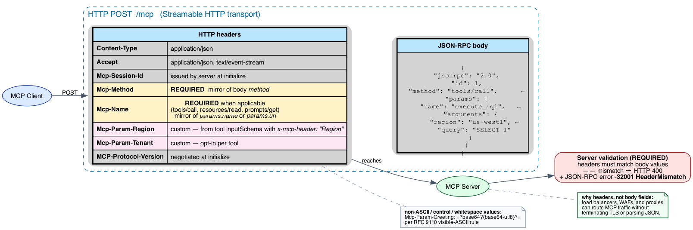

# MCP Draft Spec: A Complete Walkthrough of `DRAFT-2026-v1`

This document describes the upcoming MCP specification — currently labeled `DRAFT-2026-v1` in `modules/modelcontextprotocol/schema/draft/schema.ts:14` — relative to the latest stable spec, `2025-11-25`. It is a companion to [`mcp-deep-dive.md`](mcp-deep-dive.md): assume that doc as background and read this one for the **delta**.

The official changelog ([`docs/specification/draft/changelog.mdx`](../../../modules/modelcontextprotocol/docs/specification/draft/changelog.mdx) in the submodule) characterizes the draft as "Minor changes" only — no major surface, no breaking removals. The story is one of **hardening**: features the `2025-11-25` spec introduced as MAY/SHOULD are being upgraded to MUST, and the schema is being formalized with stronger types and a comprehensive examples corpus.

***

## At a glance

| Area | Change | Direction |
|------|--------|-----------|
| Streamable HTTP headers | `Mcp-Method`, `Mcp-Name` now **REQUIRED**, with `-32001 HeaderMismatch` validation | Tightening (SEP-2243) |
| Custom HTTP headers | `x-mcp-header` annotation in tool inputSchema → `Mcp-Param-{Name}`; clients **MUST** support | New requirement |
| Server-to-client requests | Standalone push now **MUST NOT** be implemented for `roots/list` / `sampling/createMessage` / `elicitation/create` | Tightening (SEP-2260) |
| HTTP 405 responses | **MUST** include `Allow` header per RFC 9110 §15.5.6 | Tightening |
| Capability negotiation | New `extensions` slot on both `ClientCapabilities` and `ServerCapabilities` | New (SEP-2133 codified) |
| `tools/list` ordering | Servers **SHOULD** return tools in deterministic order | New guidance |
| Tool name uniqueness | Scoped to a single server; aggregators must disambiguate | Clarification |
| Authorization | Per-AS registration state, step-up scope handling, OIDC DCR 1.0 acknowledged | Tightening |
| Sampling tools | Tool definitions in sampling are scoped to the request, not registered tools | Clarification |
| `_meta` keys | OpenTelemetry `traceparent`/`tracestate`/`baggage` formally documented | New (SEP-414 codified) |
| Schema typing | New `JSONValue/Object/Array`, `MetaObject`, `RequestMetaObject`, typed JSON-RPC error subclasses, per-method `*ResultResponse` wrappers | Formalization |
| Examples corpus | 134 JSON example files, one per type, under `schema/draft/examples/` | New |
| SEP process | PR-based file workflow is the standard | Process (SEP-1850) |

The protocol-version constant is `LATEST_PROTOCOL_VERSION = "DRAFT-2026-v1"` (`schema.ts:34`).

***

## 1. Streamable HTTP headers — required, validated, extensible



In `2025-11-25`, **SEP-2243** added `Mcp-Method` and `Mcp-Name` headers as a routing affordance — load balancers and WAFs could use them to direct traffic without terminating TLS or parsing the JSON body. They were optional. The draft promotes them to **REQUIRED**:

> "The client **MUST** include the standard MCP request headers on each POST request." — [`docs/specification/draft/basic/transports.mdx`](../../../modules/modelcontextprotocol/docs/specification/draft/basic/transports.mdx)

| Header | Required for |
|--------|--------------|
| `Mcp-Method` | every request and notification |
| `Mcp-Name` | `tools/call`, `resources/read`, `prompts/get` (mirror of `params.name` or `params.uri`) |

### Server-side validation is mandatory

The draft introduces a JSON-RPC error code in the implementation-defined range:

| Code | Name | Trigger |
|------|------|---------|
| `-32001` | `HeaderMismatch` | required header missing, header value does not match the body, or value contains invalid characters |

Validation is non-negotiable: *"Servers that process the request body **MUST** reject requests where the values specified in the headers do not match the corresponding values in the request body."* This closes a class of attacks where two components in the network look at different sources of truth (a load balancer routes on header X while the server executes body Y).

### Custom headers: `x-mcp-header`

A new opt-in extension lets servers expose tool parameters as HTTP headers. In a tool's `inputSchema`, properties may carry an `x-mcp-header: "Name"` annotation; the client **MUST** mirror that parameter's value into a header named `Mcp-Param-{Name}`.

Example tool definition:

```json
{
  "name": "execute_sql",
  "inputSchema": {
    "type": "object",
    "properties": {
      "region": { "type": "string", "x-mcp-header": "Region" },
      "query":  { "type": "string" }
    },
    "required": ["region", "query"]
  }
}
```

Constraints (`docs/specification/draft/basic/transports.mdx#schema-extension`):

- `x-mcp-header` value MUST NOT be empty, MUST be ASCII (no space or `:`), MUST be case-insensitively unique within a single `inputSchema`, MUST only annotate primitive types (number, string, boolean).
- Clients MUST reject (exclude from `tools/list` results) any tool definition that violates these rules and SHOULD log a warning.
- Non-ASCII / control / whitespace values MUST be Base64-encoded with a wrapper: `Mcp-Param-{Name}: =?base64?{base64-utf8}?=`.

The mechanism enables enterprise routing patterns — region-aware geo-routing, tenant load balancing, priority lanes — without forcing every tool to invent its own convention. **Clients must implement; servers may opt in.**

### HTTP 405 responses

The draft adds a small but explicit RFC compliance rule: when the server returns 405 Method Not Allowed (e.g., for an unsupported GET on the MCP endpoint, or for refusing a session DELETE), it **MUST** include an `Allow` header listing the methods it does support, per RFC 9110 §15.5.6. This is the kind of fix that costs nothing to implement but matters when MCP traffic flows through generic HTTP infrastructure that expects RFC-conforming responses.

### Standalone GET streams are nearly silent

A subtle but important change in [`docs/specification/draft/basic/transports.mdx`](../../../modules/modelcontextprotocol/docs/specification/draft/basic/transports.mdx):

> "If the server initiates an SSE stream:
> – The server **MAY** send JSON-RPC _notifications_ and _pings_ on the stream.
> – These messages **SHOULD** be unrelated to any concurrently-running JSON-RPC request from the client, **except** that `roots/list`, `sampling/createMessage`, and `elicitation/create` requests **MUST NOT** be sent on standalone streams."

In `2025-11-25` the corresponding text said the server MAY send JSON-RPC requests *and* notifications on standalone GETs. The draft narrows that to *notifications and pings*. Standalone server-initiated requests of those three types are forbidden, period. This is **SEP-2260** moving from Accepted into the canonical text — see §3 below.

***

## 2. Extensions: a real capability slot, not just `experimental.*`

In `2025-11-25`, the **SEP-2133** Extensions framework (Final) defined identifiers, lifecycles, and registration paths for extensions like MCP Apps and OAuth Client Credentials. But the *capability negotiation slot* for them lived informally under `experimental` or sat outside the schema entirely.

The draft adds a first-class field. From [`lifecycle.mdx`](../../../modules/modelcontextprotocol/docs/specification/draft/basic/lifecycle.mdx):

| Category | Capability | Description |
|----------|------------|-------------|
| Client | `extensions` | Support for optional extensions beyond the core protocol |
| Server | `extensions` | Support for optional extensions beyond the core protocol |

Both sides advertise as a map of extension identifier → settings object:

```json
{
  "capabilities": {
    "roots": {},
    "extensions": {
      "io.modelcontextprotocol/apps": {
        "mimeTypes": ["text/html;profile=mcp-app"]
      }
    }
  }
}
```

The format mirrors what SEP-2133 had already documented; the change is that it's now **schema-level**, not "look at this side document." Each extension defines its own settings schema; both sides must declare to use one; non-supporting sides degrade or reject per extension policy.

The pre-existing `experimental` slot remains, alongside `extensions`. Use `experimental.*` for unproposed work; `extensions` for anything tracked through the SEP-2133 lifecycle.

***

## 3. Server-to-client requests must be associated — now MUST

`2025-11-25` already nudged this direction (SEP-2260 was Accepted at that revision); the draft codifies it. The relevant `<Warning>` blocks now appear in both [`client/sampling.mdx`](../../../modules/modelcontextprotocol/docs/specification/draft/client/sampling.mdx) and [`client/elicitation.mdx`](../../../modules/modelcontextprotocol/docs/specification/draft/client/elicitation.mdx):

> "Servers **MUST** send server-to-client requests (such as `roots/list`, `sampling/createMessage`, or `elicitation/create`) only in association with an originating client request (e.g., during `tools/call`, `resources/read`, or `prompts/get` processing). Standalone server-initiated requests of these types on independent communication streams (unrelated to any client request) are not supported and **MUST NOT** be implemented. Future transport implementations are not required to support this pattern."

Three downstream consequences:

- **Transport designers don't need standalone bidirectional channels.** The reduction from "any time" to "during a client request" simplifies SSE plumbing, especially around resumability.
- **UX is clearer.** A user only sees an elicitation when they initiated something — there's no "the server randomly asked for your password while you weren't looking."
- **Security surface shrinks.** A compromised server can't ambush the user in idle state.

The exception remains `ping`, which can flow either direction at any time.

***

## 4. Tools

Three changes in [`server/tools.mdx`](../../../modules/modelcontextprotocol/docs/specification/draft/server/tools.mdx):

### Deterministic ordering (new SHOULD)

> "Servers **SHOULD** return tools in a deterministic order (i.e., the same ordering across requests when the underlying set of tools has not changed). Deterministic ordering enables clients to reliably cache the tool list and improves LLM prompt cache hit rates when tools are included in model context."

This is purely an optimization hint, but a high-leverage one. Anthropic's prompt caching (and similar mechanisms at other providers) stores cached prefixes keyed on byte-identical content. If a server's tool list shuffles between calls, every model invocation re-pays the cache miss. Deterministic order fixes that.

### Tool name uniqueness clarified

The draft adds an explicit note: tool name uniqueness is **scoped to a single server**. Aggregating clients or proxies that combine tools from multiple servers may see collisions (two `search` tools, two `query` tools) and **SHOULD** implement a disambiguation strategy — typically prefixing with a server identifier. The server `name` from initialize is **not guaranteed unique** and SHOULD NOT be relied on for disambiguation. Aggregators should use something stronger (a registry-issued identifier, a configured prefix).

### `x-mcp-header` annotation

Tool input properties **MAY** carry an `x-mcp-header` annotation; see §1 above. From the schema's perspective the inputSchema is unchanged structurally — `x-mcp-header` is an extra property that JSON Schema 2020-12 ignores by default.

***

## 5. Authorization tightening

Several updates in [`basic/authorization.mdx`](../../../modules/modelcontextprotocol/docs/specification/draft/basic/authorization.mdx):

- **OpenID Connect Dynamic Client Registration 1.0** is now explicitly listed as a referenced standard, alongside RFC 7591 DCR.
- **Per-authorization-server registration state.** When a Protected Resource Metadata document lists multiple `authorization_servers`, each is independent. Per RFC 6749 §2.2, client identifiers belong to the AS that issued them. Clients **MUST** maintain separate registration state (credentials, tokens) per AS and **MUST NOT** assume credentials valid for one AS will work at another.
- **Step-up authorization clarified.** When a server returns insufficient_scope for the current operation, those scopes are required for *that operation*; when re-authorizing, clients **SHOULD** include them alongside any previously granted scopes to avoid losing permissions held for other operations. This protects users from being silently downgraded by a re-auth flow.
- **Discovery URI clarified.** MCP uses the default `oauth-authorization-server` well-known URI suffix per RFC 8414 §3.1; the spec now states explicitly that *MCP does not define an application-specific well-known URI suffix.* Clients still attempt multiple well-known endpoints to interop with both OAuth 2.0 AS Metadata and OIDC Discovery 1.0.

These are quality-of-implementation fixes, not new flows. The pattern continues from `2025-11-25`: MCP servers are Resource Servers; AS responsibilities live elsewhere; clients carry the burden of correctly handling AS heterogeneity.

***

## 6. Sampling — tool-scope clarified

In [`client/sampling.mdx`](../../../modules/modelcontextprotocol/docs/specification/draft/client/sampling.mdx) the description of `tools` in a `sampling/createMessage` request now adds:

> "The tool definitions in the `tools` array are scoped to the sampling request — they don't need to correspond to registered tools."

This was probably implicit in `2025-11-25` but is now explicit: a server can synthesize one-off tools just for a sampling call (think: a tool that extracts a structured field from the user's message, used only inside that single agent loop) without registering them in `tools/list`. The model sees them; the rest of the host does not. Capability gating from SEP-1577 remains unchanged: the server **MUST** only include `tools` if the client declared `ClientCapabilities.sampling.tools`.

***

## 7. Elicitation — stability disclaimer

The draft adds an explicit `<Note>` to [`client/elicitation.mdx`](../../../modules/modelcontextprotocol/docs/specification/draft/client/elicitation.mdx):

> "Elicitation is newly introduced in this version of the MCP specification and its design may evolve in future protocol versions."

The text dates from `2025-11-25` (when the modern Elicitation surface, including URL mode and the `-32042` redirect error, was introduced). The disclaimer signals that further refinement is expected. Implementers should not over-fit to the current shape; the form/url split and PrimitiveSchemaDefinition restrictions are likely to evolve.

***

## 8. Schema-level formalization

The schema diff is large (~700 added lines) but the *protocol surface* — the set of methods and their semantics — is unchanged. The size reflects two pieces of work:

### 8.1 New foundation types

```ts
export type JSONValue = string | number | boolean | null | JSONObject | JSONArray;
export type JSONObject = { [key: string]: JSONValue };
export type JSONArray = JSONValue[];

export type MetaObject = Record<string, unknown>;
export interface RequestMetaObject extends MetaObject { ... }
```

`JSONValue` and friends close a long-standing implicit assumption — payloads carry JSON data — by giving it a name. `MetaObject` and `RequestMetaObject` formalize what `_meta` is so that downstream typing for OTel keys and protocol metadata becomes precise rather than `[key: string]: unknown`.

### 8.2 Typed JSON-RPC error subclasses

```ts
export interface ParseError extends Error { code: typeof PARSE_ERROR; ... }
export interface InvalidRequestError extends Error { code: typeof INVALID_REQUEST; ... }
export interface MethodNotFoundError extends Error { code: typeof METHOD_NOT_FOUND; ... }
export interface InvalidParamsError extends Error { code: typeof INVALID_PARAMS; ... }
export interface InternalError extends Error { code: typeof INTERNAL_ERROR; ... }
```

Five interface types pinning each standard JSON-RPC error code to its own type. This pairs with `URLElicitationRequiredError` (`-32042`) and the new `HeaderMismatch` (`-32001`) to give SDKs precise discriminators.

### 8.3 Per-method `*ResultResponse` wrappers

`2025-11-25` already (via SEP-1319) decoupled payload types from RPC method definitions — `CallToolRequestParams` is a standalone interface referenced by `CallToolRequest`. The draft completes the symmetry on the response side:

```ts
export interface CallToolResultResponse extends JSONRPCResultResponse { ... }
export interface InitializeResultResponse extends JSONRPCResultResponse { ... }
export interface CreateMessageResultResponse extends JSONRPCResultResponse { ... }
// ...one per method that produces a result
```

This enables future transport bindings (gRPC, Protocol Buffers) to pin response shapes to specific methods without re-deriving them, and enables stricter SDK typing where `tools/call` returns specifically a `CallToolResultResponse` rather than a generic `JSONRPCResultResponse`.

### 8.4 The examples corpus

The draft adds `schema/draft/examples/` containing **134 JSON files** organized by type — one directory per schema interface, with one or more JSON instances inside each:

```
schema/draft/examples/
  CallToolRequest/
  CallToolResultResponse/
  ClientCapabilities/
  ElicitRequestFormParams/
  ElicitRequestURLParams/
  ... 130 more
```

Each example file is referenced from the TypeScript schema via `@includeCode` JSDoc tags, so the published schema docs render real, validated examples rather than hand-written snippets. For implementers, this turns "how does this type actually look on the wire" from a guessing game into a test fixture.

***

## 9. SEPs landing in the draft

The official changelog cites four SEPs against this revision; all are codifications of work that was Final or Accepted as of `2025-11-25`:

| SEP | Title | Maturity | Effect on draft |
|-----|-------|----------|-----------------|
| **SEP-414** | OTel Trace Context conventions | Final | `_meta` keys (`traceparent`, `tracestate`, `baggage`) now formally documented |
| **SEP-2243** | HTTP Header standardization | Final | `Mcp-Method`/`Mcp-Name` from MAY → MUST; `x-mcp-header` mirroring required of clients; `-32001 HeaderMismatch` validation |
| **SEP-2260** | Server requests must associate with client request | Accepted → Codified | MUST language now in sampling/elicitation/roots; standalone push forbidden |
| **SEP-1850** | PR-based SEP workflow | Final | Process change: SEPs live in `seps/{PR-NUMBER}-{slug}.md`; PR# = SEP# |

In addition, the `extensions` capability slot reflects **SEP-2133** (already Final in `2025-11-25` but only schema-level in the draft), and the OIDC DCR 1.0 acknowledgement aligns with **SEP-2207** (Accepted) on refresh-token guidance.

***

## 10. What did *not* change

It's worth being explicit because it's tempting to assume more change than there is:

- **Method set is identical.** No new JSON-RPC methods were added. `tools/*`, `resources/*`, `prompts/*`, `sampling/*`, `roots/*`, `elicitation/*`, `tasks/*`, `completion/*`, `logging/*`, `ping`, and the `notifications/*` family are exactly as they were in `2025-11-25`.
- **Six core primitives unchanged.** Tools, Resources, Prompts, Sampling, Roots, Elicitation — same names, same control models, same direction of initiation.
- **Tasks primitive unchanged.** State machine, `tasks/get`/`/result`/`/list`/`/cancel`, `notifications/tasks/status`, `Tool.execution.taskSupport` — all intact from SEP-1686.
- **Transport set unchanged.** STDIO and Streamable HTTP only; HTTP+SSE polling per SEP-1699 still applies.
- **No deprecations of fields or methods.** The soft-deprecation of `includeContext` values `"thisServer"`/`"allServers"` (introduced in SEP-1577) remains soft-deprecated, not removed.
- **No schema breaking changes.** Existing wire shapes are untouched; everything new is additive (new fields, new types) or a tightening of an existing rule's modal verb.

This means a `2025-11-25`-conformant client should keep working against a `DRAFT-2026-v1` server *unless* the server uses the new MUST-required headers and the client doesn't send them. In practice, the header tightening is what makes the draft a real upgrade rather than an alias.

***

## 11. Stability and what to watch

The draft is **not** ratified. From the upstream submodule's `CLAUDE.md`:

> "schema/draft/ and docs/specification/draft/ — in-progress work"

Things that may shift before the next dated release:

- **Elicitation** — explicitly flagged as "design may evolve" in [`client/elicitation.mdx`](../../../modules/modelcontextprotocol/docs/specification/draft/client/elicitation.mdx).
- **Refresh token guidance (SEP-2207, Accepted)** — currently informational; a future spec could promote pieces to normative.
- **Anything under `extensions` / `experimental`** — by definition, neither has stability guarantees.
- **Examples corpus** — likely to grow; specific JSON examples may be edited as types are refined.
- **`DRAFT-2026-v1` label itself** — the constant is a placeholder; the actual release will use a date-stamped name.

To track changes between now and ratification:

```sh
# from the bridge repo root
git -C modules/modelcontextprotocol log --oneline schema/draft/schema.ts | head
git -C modules/modelcontextprotocol log --oneline docs/specification/draft/ | head
```

Or watch the upstream PR feed at [`github.com/modelcontextprotocol/modelcontextprotocol`](https://github.com/modelcontextprotocol/modelcontextprotocol) — every spec change requires a SEP, and SEPs are PRs against `seps/`.

***

## 12. References

All paths relative to `modules/modelcontextprotocol/`.

- **Draft schema (TypeScript SoT)**: `schema/draft/schema.ts`
- **Draft schema (JSON)**: `schema/draft/schema.json`
- **Draft schema examples**: `schema/draft/examples/` (134 JSON files)
- **Draft changelog**: `docs/specification/draft/changelog.mdx`
- **Draft transports**: `docs/specification/draft/basic/transports.mdx`
- **Draft lifecycle**: `docs/specification/draft/basic/lifecycle.mdx`
- **Draft authorization**: `docs/specification/draft/basic/authorization.mdx`
- **Draft tools**: `docs/specification/draft/server/tools.mdx`
- **Draft sampling**: `docs/specification/draft/client/sampling.mdx`
- **Draft elicitation**: `docs/specification/draft/client/elicitation.mdx`
- **SEPs cited in this doc**: `seps/414-request-meta.md`, `seps/1850-pr-based-sep-workflow.md`, `seps/2133-extensions.md`, `seps/2207-oidc-refresh-token-guidance.md`, `seps/2243-http-standardization.md`, `seps/2260-Require-Server-requests-to-be-associated-with-Client-requests.md`
- **Upstream GitHub compare** (live diff between revisions): `https://github.com/modelcontextprotocol/specification/compare/2025-11-25...draft`

For the full deep dive on the protocol layers this draft modifies, see [`mcp-deep-dive.md`](mcp-deep-dive.md).
