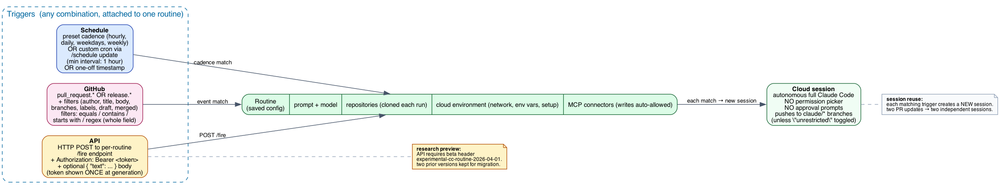
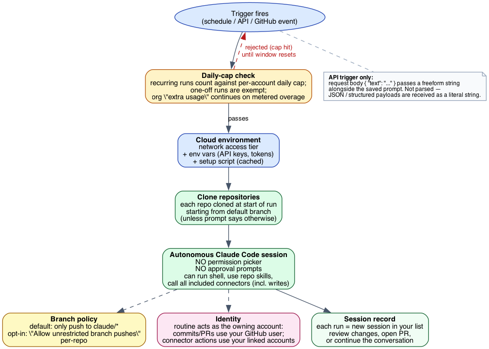
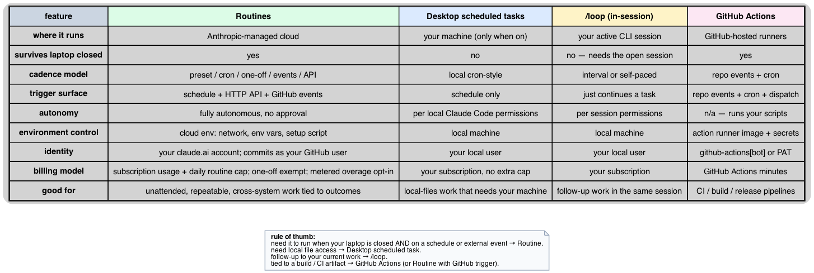

# Routines Deep Dive: Why the Design Looks the Way It Does

This is the companion to [`what-is-routines.md`](what-is-routines.md). The introduction tells you *what* a routine is and *how* to create one. This document examines *why* the surface is shaped this way — the design tradeoffs encoded in the trigger model, the autonomy decisions, the billing carve-outs, and the deliberate gaps between routines and adjacent automation features.

There is no upstream submodule for Claude Code, so claims here are anchored to the official docs page at <https://code.claude.com/docs/en/routines.md> and to the surrounding pages it links to. Where this topic intersects MCP — connectors, beta-header conventions — the relevant cross-references point into our `modules/modelcontextprotocol/` material.

***

## How to read this document

Sections are grouped by design dimension, not by feature surface:

1. **Trigger model** — three composable trigger types and the design rationale.
2. **Execution model** — autonomous sessions, branch policy, identity.
3. **API trigger details** — bearer-token auth, beta headers, freeform `text` payload.
4. **GitHub trigger details** — event categories, filter operators, regex semantics.
5. **Schedule semantics** — minimum interval, stagger, one-off carve-outs.
6. **Usage and limits** — the dual cap design and one-off exemption.
7. **Adjacent features and where routines fit** — `/loop`, Desktop scheduled tasks, GitHub Actions.
8. **Research-preview disclaimers** — what's likely to change.
9. **References** — every external link cited.

***

## 1. Trigger model: three orthogonal mechanisms, one config



A routine is a **saved configuration** — prompt, model, repos, environment, connectors — to which one or more **triggers** are attached. The three trigger types are deliberately orthogonal:

- **Schedule** answers *"run on a clock."*
- **API** answers *"run when something else fires me."*
- **GitHub** answers *"run when this repo changes."*

> "A single routine can combine triggers. For example, a PR review routine can run nightly, trigger from a deploy script, and also react to every new PR." — [routines docs §intro](https://code.claude.com/docs/en/routines.md)

This composability is the design choice that makes routines distinct from cron jobs (schedule-only), webhooks (event-only), or REST APIs (manual-only). The same review checklist can run on three cadences simultaneously without three separate configurations drifting out of sync.

The cost: any change to the prompt or environment affects all attached triggers. There's no per-trigger override of the saved config.

### Why API trigger configuration is web-only

The CLI's `/schedule` creates only scheduled routines. To add an API token or GitHub trigger to an existing routine, the user must edit on the web.

> "API triggers are added to an existing routine from the web. The CLI cannot currently create or revoke tokens." — [routines docs §Add an API trigger](https://code.claude.com/docs/en/routines.md)

This isn't accidental. The API token is a long-lived credential that grants the bearer the ability to fire arbitrary work as the routine owner. Showing it once on the web — where the user is freshly authenticated and visually present — is a more controlled trust ceremony than displaying it in a CLI session that may be running in a screen-shared meeting or logged shell.

***

## 2. Execution model: autonomy with scoped reach



The execution model commits to a sharp design choice:

> "Routines run autonomously as full Claude Code cloud sessions: there is no permission-mode picker and no approval prompts during a run." — [routines docs §Create a routine](https://code.claude.com/docs/en/routines.md)

This is the inverse of interactive sessions, where the user is in the loop for risky operations. The reasoning is pragmatic: a routine that fires at 3 a.m. has no human to consult. Approval prompts in an autonomous run would either block forever or auto-approve everything, neither of which is useful.

Safety, instead, comes from **scoping at configuration time**:

| Lever | What it controls |
|-------|------------------|
| Repository selection | Which codebases a run can clone and read |
| Branch-push setting | Default `claude/*`-only; opt-in "unrestricted" per-repo |
| Cloud environment | Network access tier, env vars, setup script |
| Connector subset | Which MCP services the run can call (writes auto-allowed for any included connector) |
| Account identity | Routines act as the owning claude.ai user — commits, PRs, Slack messages all carry that identity |

The crucial implication: **anything a connector can do for an interactive user, a routine can do without confirmation**. If your connected Slack can post to `#general`, so can your routine. The `Connectors` tab in the routine form is therefore a security control, not a convenience: the docs explicitly recommend removing connectors the routine doesn't need.

### The `claude/` branch convention as a default-deny rail

By default, runs can only push to branches whose names start with `claude/`. This is one of the few hard rails in routines:

> "By default, Claude can only push to branches prefixed with `claude/`. This prevents routines from accidentally modifying protected or long-lived branches." — [routines docs §Repositories and branch permissions](https://code.claude.com/docs/en/routines.md)

The convention works because most teams already treat `claude/` as a code-review-pending namespace from interactive use. Removing the rail (per-repo "Allow unrestricted branch pushes") is opt-in and intentional, not the default. A routine that misbehaves under default settings produces a stack of unmerged `claude/` branches; the same routine with unrestricted pushes can rewrite history on `main`.

### Identity is the user's, not a bot

Unlike GitHub Actions (which run as `github-actions[bot]` or a PAT), routines act as the owning user:

> "Anything a routine does through your connected GitHub identity or connectors appears as you: commits and pull requests carry your GitHub user, and Slack messages, Linear tickets, or other connector actions use your linked accounts." — [routines docs §Create a routine](https://code.claude.com/docs/en/routines.md)

This is convenient for code-review attribution and for connectors that lack bot accounts, but it has a clear consequence: **a misbehaving routine looks indistinguishable from the user**. There's no "this comment was made by a routine" marker in commits or messages. Audit reasoning has to come from the session record on the claude.ai side, not from the receiving system.

***

## 3. API trigger details

The API endpoint is `POST /v1/claude_code/routines/<routine_id>/fire`, with a per-routine bearer token in `Authorization` and an optional `text` field in the JSON body.

```
POST /v1/claude_code/routines/trig_01ABCDEFGHJKLMNOPQRSTUVW/fire
Authorization: Bearer sk-ant-oat01-xxxxx
anthropic-beta: experimental-cc-routine-2026-04-01
anthropic-version: 2023-06-01
Content-Type: application/json

{"text": "Sentry alert SEN-4521 fired in prod. Stack trace attached."}
```

A few non-obvious details from the docs:

- **The `text` field is freeform and not parsed**: *"if you send JSON or another structured payload, the routine receives it as a literal string."* This is a deliberate choice — the prompt knows how to read text; structured payloads would create a mini-protocol routines would need to version. By keeping it freeform, the burden of structure shifts to the prompt, where it can evolve without API changes.
- **The token is per-routine, not per-account**: each routine has its own. Compromising one token only fires that one routine.
- **The token is revealed once.** The web modal supports `Generate token`, `Regenerate` (rotating), and `Revoke`.
- **The endpoint returns a session URL**: `{ "claude_code_session_id": "...", "claude_code_session_url": "https://claude.ai/code/session_..." }`. This lets the calling system link directly into the running session for human follow-up — important for the alert-triage and deploy-verification use cases.
- **The endpoint is claude.ai-only.** It's not part of the Claude Platform API. That's also why it ships behind a beta header: it's an experimental surface bolted onto a consumer product, not a stable enterprise API.
- **Beta-header migration policy**: *"Breaking changes ship behind new dated beta header versions, and the two most recent previous header versions continue to work so that callers have time to migrate."* This is the same pattern Anthropic uses elsewhere — including in MCP's auth surface where SEPs land in dated spec revisions. See [`../mcp/mcp-deep-dive.md`](../mcp/mcp-deep-dive.md) §10 (Spec versioning) for the analogous pattern.

***

## 4. GitHub trigger details

The supported event categories are intentionally narrow:

| Event category | Triggers when |
|----------------|----------------|
| `pull_request` | A PR is opened, closed, assigned, labeled, synchronized, or otherwise updated |
| `release` | A release is created, published, edited, or deleted |

Within each category, you can pick a specific action (e.g., `pull_request.opened`) or react to all actions in the category. Pushes, issues, comments, and check-runs are *not* supported as direct triggers — those would require either an API trigger called from a GitHub Action, or a custom webhook handler.

### Filter operators and the regex gotcha

Filters narrow which PR events fire the routine. Available fields: author, title, body, base/head branch, labels, draft state, merged state. Operators: `equals`, `contains`, `starts with`, `is one of`, `is not one of`, `matches regex`.

The regex behavior is the most likely place to bite a careful user:

> "The `matches regex` operator tests the entire field value, not a substring within it. To match any title containing `hotfix`, write `.*hotfix.*`. Without the surrounding `.*`, the filter matches only a title that is exactly `hotfix` with nothing before or after." — [routines docs §Filter pull requests](https://code.claude.com/docs/en/routines.md)

This is anchored-by-default regex semantics — the same model used by RE2 in safe-regex contexts and by `^…$` in many web platforms. For literal substring matching, the docs explicitly recommend the `contains` operator instead. The pitfall: a regex like `\bhotfix\b` won't match because there's no implicit `.*` wrapping; it has to be `.*\bhotfix\b.*`.

### Each event = a new session

GitHub-triggered routines never reuse sessions:

> "Each matching GitHub event starts a new session. Session reuse across events is not available for GitHub-triggered routines, so two PR updates produce two independent sessions." — [routines docs §How sessions map to events](https://code.claude.com/docs/en/routines.md)

This avoids the consistency hazard of "what does my routine see when a PR is updated three times in a minute?" — each event is independent. The cost is duplication of work; if the same PR is rebased five times, the routine runs five times.

### The Claude GitHub App is required

`/web-setup` grants repository **read access for cloning**, but *does not* install the Claude GitHub App and does not enable webhook delivery. The trigger setup prompts to install the app. This is a deliberate split: cloning needs only a token; receiving webhooks needs the app to be installed in the org/repo. Two distinct privilege scopes.

***

## 5. Schedule semantics

Schedule triggers are the simplest, but a few details matter:

- **Times are local-zone, converted to UTC.** *"Times are entered in your local zone and converted automatically, so the routine runs at that wall-clock time regardless of where the cloud infrastructure is located."* This avoids the classic cron problem of having to think in UTC.
- **Minimum interval is one hour.** *"The minimum interval is one hour; expressions that run more frequently are rejected."* This is a load-protection choice and frames routines as "minutes-to-hours work," not "constantly polling."
- **Stagger is built in.** *"Runs may start a few minutes after the scheduled time due to stagger. The offset is consistent for each routine."* Multiple users scheduling for "every hour on the hour" would otherwise create thundering-herd load on the cloud infrastructure. Staggering by routine smooths it out, and consistency-per-routine means a routine doesn't drift in a way that breaks downstream expectations.
- **Custom cron requires the CLI.** Pick the closest preset on the web, then refine via `/schedule update`. This pushes power-user features to the power-user surface.
- **One-off runs auto-disable after firing**: *"After the routine fires, it auto-disables and the web UI marks it as **Ran**."* This is the intended pattern — to fire it again, edit and re-set the time. Treats one-off runs as fundamentally different from recurring schedules, which is reflected in their billing too (next section).

### One-off as a first-class citizen

The docs encourage a specific use of one-off runs:

> "Use it to remind yourself later in the week, to open a cleanup PR after a rollout finishes, or to kick off a follow-up task when an upstream change lands."

This dovetails directly with the recurring suggestion in this very repo's CLAUDE.md ("after you finish work that has a natural future follow-up, end your reply with a one-line offer to schedule a background agent"). One-off routines are the realization of that pattern: a finite future task, not a forever-cron.

***

## 6. Usage and limits: the dual-cap design

Routines have two caps that compose:

1. **Subscription usage** — the same usage your interactive sessions consume.
2. **A daily routine-run cap** — a per-account ceiling on *how many recurring routine runs can start per day*.

The notable carve-out:

> "One-off runs do not count against the daily routine cap. They draw down your regular subscription usage like any other session, but they are exempt from the per-account daily routine run allowance." — [routines docs §Usage and limits](https://code.claude.com/docs/en/routines.md)

Why the asymmetry?

- A recurring routine fires forever. The daily cap is a circuit-breaker against runaway configurations and against the worst-case "user creates 50 hourly routines" scenario.
- A one-off routine fires exactly once. There's no scaling concern, so it doesn't need a cap separate from regular subscription usage.

This matches an explicit design intent: one-off runs are "tasks I'd otherwise do later"; recurring runs are "automation I'd otherwise have a cron job for." The system bills them like the things they substitute for.

When caps are hit:

- Organizations with **extra usage** enabled keep running on metered overage.
- Without extra usage, runs are rejected until the window resets.

This is the same pattern most cloud services use for soft-limited features — give users a default ceiling, let them opt into pay-as-you-go beyond it.

***

## 7. Adjacent features and where routines fit



The Claude Code automation surface has four overlapping mechanisms:

| Feature | Where it runs | Trigger surface | Survives laptop closed |
|---------|---------------|-----------------|------------------------|
| **Routines** | Anthropic cloud | schedule + API + GitHub events | yes |
| **Desktop scheduled tasks** | your machine | schedule | no |
| **`/loop`** | active CLI session | self-paced or interval | no |
| **GitHub Actions** | GitHub-hosted runners | repo events + cron + dispatch | yes |

Rules of thumb:

- **Need it to run when your laptop is closed AND on a schedule or external event** → Routine.
- **Need local file access** (your home directory, machine-specific tools) → Desktop scheduled task.
- **Follow-up to your current work** → `/loop` inside the session.
- **Tied to a build / CI artifact** → GitHub Actions, or a Routine with a GitHub trigger if Claude is the driver of the work.

The features aren't interchangeable. Routines and GitHub Actions overlap most: both run on cloud infrastructure, both react to repo events. The split is about *who drives the work*. Routines run **Claude Code as the driver** and produce sessions you review; Actions run **your scripts as the driver** with Claude Code as one possible step.

### Cross-references

- **`/loop`** in this repo: see the `/loop` skill and [`docs/topics/routines/what-is-routines.md`](what-is-routines.md) §Related features.
- **MCP connectors** (used by routines as their reach into external systems): see [`../mcp/mcp-deep-dive.md`](../mcp/mcp-deep-dive.md) for the protocol that powers the connectors.
- **`schedule` skill** in Claude Code itself — codifies the proactive offer pattern for one-off routines after work that has a natural follow-up.

***

## 8. What's likely to change (research preview)

The docs explicitly flag that the feature is in **research preview**. From the page:

> "Routines are in research preview. Behavior, limits, and the API surface may change."

> "The `/fire` endpoint ships under the `experimental-cc-routine-2026-04-01` beta header. Request and response shapes, rate limits, and token semantics may change while the feature is in research preview."

Given the surface, plausible churn points to expect:

- **More GitHub event categories** — issues, comments, check-runs are the obvious next additions.
- **Structured (vs freeform) `text` payloads** — once the freeform-string approach hits its limits with complex callers.
- **Webhook caps** evolve as the team learns load profiles. Expect them to change before GA.
- **Daily routine-run cap values** likely evolve, possibly with plan-tier differentiation.
- **CLI parity for API/GitHub trigger management** — currently web-only; that asymmetry is the kind of thing that gets resolved in research-preview-to-GA windows.

The migration policy ("two prior beta header versions continue to work") is itself a design hint: the team expects breaking changes and has built the migration path in from the start. Callers should pin the beta header explicitly and watch for new dated versions.

***

## 9. References

### Primary source

- [Automate work with routines](https://code.claude.com/docs/en/routines.md) — the official Claude Code docs page (April 2026), source for every claim above.

### Adjacent Claude Code docs cited

- [Claude Code on the web](https://code.claude.com/docs/en/claude-code-on-the-web) — cloud session infrastructure routines run on.
- [Cloud environment](https://code.claude.com/docs/en/claude-code-on-the-web#the-cloud-environment) — network access, env vars, setup script configuration.
- [`/loop` and in-session scheduling](https://code.claude.com/docs/en/scheduled-tasks) — local task scheduling.
- [Desktop scheduled tasks](https://code.claude.com/docs/en/desktop-scheduled-tasks) — local cron-style tasks.
- [MCP connectors](https://code.claude.com/docs/en/mcp) — the protocol routines use to reach external services.
- [GitHub Actions](https://code.claude.com/docs/en/github-actions) — the alternative for CI-pipeline work.
- [Trigger a routine via API](https://platform.claude.com/docs/en/api/claude-code/routines-fire) — full API reference for the `/fire` endpoint.

### Cross-references in this repo

- [`what-is-routines.md`](what-is-routines.md) — introductory companion to this doc.
- [`../mcp/mcp-deep-dive.md`](../mcp/mcp-deep-dive.md) — MCP protocol details, relevant since routines use MCP connectors as their primary reach into external systems.
- [`../mcp/mcp-draft-spec.md`](../mcp/mcp-draft-spec.md) §10 — the dated beta-header pattern routines adopt.
