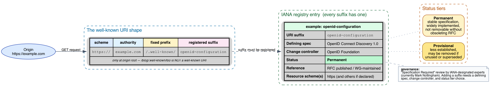
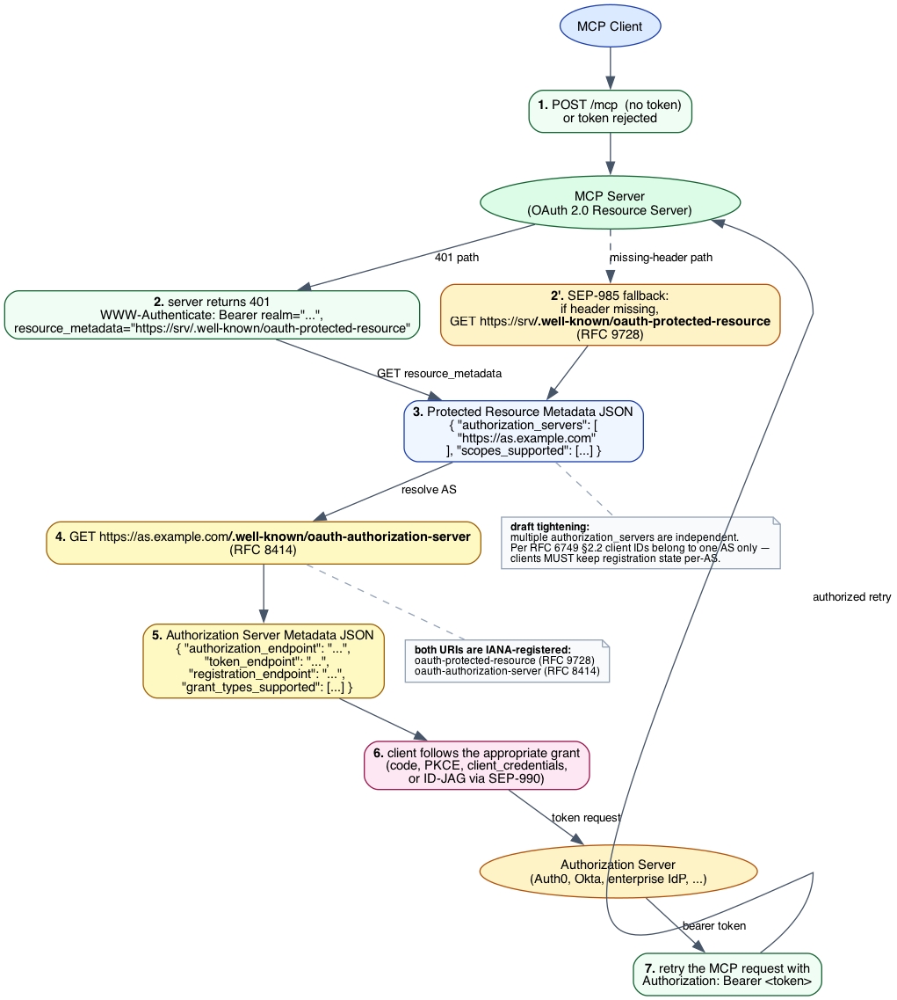
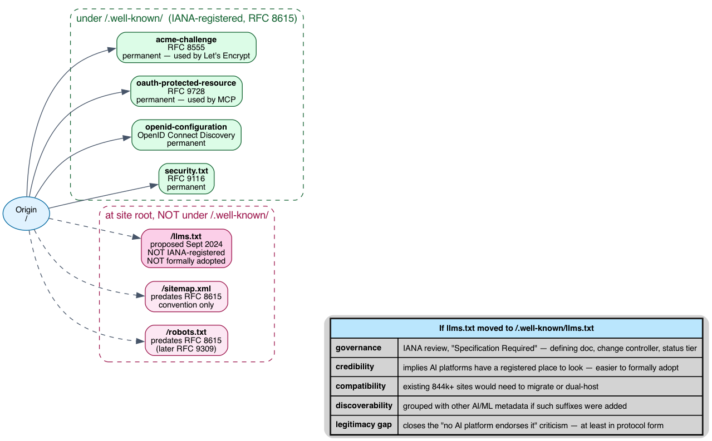

# `.well-known/` Deep Dive: Why a Fixed Prefix and a Registry

This is the companion to [`what-is-well-known.md`](what-is-well-known.md). The introduction explains *what* the standard is and *who* uses it. This document examines *why* it was designed the way it was, the tradeoffs encoded in the design, how MCP uses it, and why some "siblings" (like `llms.txt`) sit at the site root instead.

Every load-bearing claim cites either an RFC, the IANA registry, or a file in our submodules. For the introductory framing of `.well-known`, see the intro doc; for MCP's auth surface that consumes two `.well-known/` URIs, see [`../mcp/mcp-deep-dive.md`](../mcp/mcp-deep-dive.md).

***

## 1. The problem `.well-known/` was invented to solve

Before 2010, every protocol that needed a "site-wide config file" picked its own path. `robots.txt` (1994), `sitemap.xml` (2005), `crossdomain.xml` (Flash), `humans.txt`, `favicon.ico`, `apple-touch-icon.png`, `clientaccesspolicy.xml` (Silverlight), `P3P/p3p.xml` — each grabbed a top-level path and squatted there.

Three problems compounded:

1. **Path-squatting collisions.** Any protocol could conflict with an existing site URL. A site that legitimately served `/sitemap.xml` as content for users had to give it up to crawlers.
2. **No predictable discovery.** A new protocol couldn't guarantee its file lived anywhere consistent. Clients had to know each path by hard-coded convention.
3. **No central oversight.** Two protocols could pick the same name. Implementations couldn't tell whether `/foo.txt` meant "this site" or "any site that happens to use this protocol."

**RFC 5785** (Nottingham & Hammer-Lahav, April 2010) solved all three with a single move: reserve `/.well-known/` as a fixed prefix, delegate everything inside it to an IANA registry. **RFC 8615** (Nottingham, May 2019) revised the spec, broadened it to URI schemes beyond HTTP, and is the version in force today.

The design is deliberately minimal: *one* fixed prefix, *one* registry, *one* governance model.

***

## 2. Anatomy and registry governance

Every well-known URI has the shape `<scheme>://<authority>/.well-known/<suffix>`. The suffix is registered with IANA. Per [RFC 8615 §3](https://www.rfc-editor.org/rfc/rfc8615#section-3), registration is **"Specification Required"**: a defining specification document exists, IANA-designated experts (currently Mark Nottingham) review submissions, and each entry pins a change controller.

Two status tiers exist:

- **Permanent** — stable specification, widely implemented. Removing or repurposing requires obsoleting RFCs.
- **Provisional** — less established. May be removed if unused or superseded.

The tiers are governance signals: clients writing tooling can trust permanent entries; provisional ones are at risk of churn.

### Why a registry — not a free-for-all

The alternative would be "anyone can pick any suffix as long as they don't collide." That replicates the pre-2010 chaos at a different scope. The registry forces a one-time review at registration time and gives downstream tooling (automated scanners, MCP servers, browsers) a single place to look up "is this a thing?"

### Why "Specification Required" rather than "RFC Required"

RFC 8615 deliberately allows registration without a full RFC — any "specification" suffices, including W3C documents, vendor specs (Apple App Site Association), or stable working-group drafts. This balances rigor against the practical reality that many useful conventions are not IETF-track.

The cost: provisional entries can be added with relatively light process. The IANA registry currently has over 100 entries, a meaningful fraction provisional.

***

## 3. Active vs passive resources

Although the registry treats every suffix uniformly, in practice there are two different *resource shapes* under `.well-known/`:

| Shape | Description | Examples |
|-------|-------------|----------|
| **Passive (static file)** | A file that sits on disk; web server returns it as-is | `security.txt`, `apple-app-site-association`, `assetlinks.json`, `mta-sts.txt` |
| **Active (dynamic endpoint)** | A request handler that generates a response — possibly per-tenant, per-locale, or with current state | `openid-configuration`, `oauth-authorization-server`, `oauth-protected-resource`, `webfinger`, `acme-challenge` |

The distinction matters for deployment:

- Passive files can be served by any static host; CDN-friendly; no compute cost.
- Active endpoints need a route handler in the application; respond with computed metadata (e.g., the AS metadata changes when keys rotate).

The spec doesn't enforce this dichotomy — it's an emergent consequence of what each suffix needs to do. But it shapes what kinds of infrastructure can host each one.

***

## 4. Scope rules: origin-bound, sharply

A `.well-known` URI lives at the **origin** root, where origin is `(scheme, host, port)` per [RFC 6454](https://www.rfc-editor.org/rfc/rfc6454). Two consequences:

- **`example.com/.well-known/foo` does not apply to `sub.example.com`.** Each subdomain is a distinct origin; each must serve its own well-known files (or have them generated dynamically).
- **`https://example.com/.well-known/foo` is distinct from `http://example.com/.well-known/foo`.** Different schemes = different origins.

Each registered spec defines its own scoping behavior on top. For example, `security.txt` (RFC 9116) explicitly addresses subdomain handling — security teams typically host one canonical file at the apex domain and configure subdomains via redirects. But `apple-app-site-association` (per Apple's docs) **must NOT redirect** — Apple's App Store verification rejects redirected responses, and several apps have shipped broken Universal Links because of misconfigured CDNs returning a 301 to the apex.

The lesson: scope rules are per-spec, not protocol-wide. Implementers must read the defining doc, not assume.

***

## 5. MCP's use of `.well-known/`

MCP is a heavy consumer of `.well-known/` for authentication discovery. Two suffixes do the work:

- **`oauth-protected-resource`** ([RFC 9728](https://www.rfc-editor.org/rfc/rfc9728)) — Protected Resource Metadata. Tells the client which Authorization Servers are valid for this resource and what scopes are supported.
- **`oauth-authorization-server`** ([RFC 8414](https://www.rfc-editor.org/rfc/rfc8414)) — Authorization Server Metadata. Tells the client where the AS's authorization, token, registration, and JWKS endpoints are.

The discovery chain (per the [draft authorization spec](../../../modules/modelcontextprotocol/docs/specification/draft/basic/authorization.mdx)):

1. Client sends an MCP request without a token (or with a rejected one).
2. Server returns `401 Unauthorized` with a `WWW-Authenticate: Bearer` header. The header should include `resource_metadata="<URL>"` pointing at the PRM document.
3. **SEP-985 fallback**: if the header is missing, the client tries `https://<server>/.well-known/oauth-protected-resource` directly. This was added because large multi-tenant deployments find it non-trivial to inject `WWW-Authenticate` headers from upstream services.
4. Client fetches the PRM, finds the `authorization_servers` list.
5. For each AS, client fetches `https://<as>/.well-known/oauth-authorization-server`. (Or, for OIDC providers, `/.well-known/openid-configuration`.)
6. Client picks an appropriate grant — authorization code (with PKCE), client credentials (SEP-1046), or ID-JAG (SEP-990) — and obtains a token.
7. Client retries the MCP request with `Authorization: Bearer <token>`.

The draft tightens this further (see [`mcp-draft-spec.md` §5](../mcp/mcp-draft-spec.md#5-authorization-tightening)):

- When the PRM lists multiple `authorization_servers`, each is independent. Per [RFC 6749 §2.2](https://www.rfc-editor.org/rfc/rfc6749#section-2.2), client identifiers are unique to the AS that issued them. Clients **MUST** maintain per-AS registration state and **MUST NOT** assume credentials valid at one AS work at another.
- MCP uses the default `oauth-authorization-server` well-known URI suffix; the draft explicitly states *"MCP does not define an application-specific well-known URI suffix."*

This is `.well-known/` working exactly as designed: standardized discovery without protocol-specific path inventions, leveraging RFCs that already existed for OAuth and OIDC.

***

## 6. Why `llms.txt` is *not* a `.well-known/` URI

`llms.txt` (Howard, September 2024) sits at `/llms.txt`, not `/.well-known/llms.txt`. The proposal doesn't justify this choice explicitly, but the consequences are visible.

**Why it's at the root:** `llms.txt` was proposed as an analog to `robots.txt` and `sitemap.xml`, both of which sit at the root for historical reasons. Howard's framing positions it as part of that family rather than as a new protocol-style discovery file.

**What it costs:**

1. **No registry, no governance.** Anyone can put any document at `/llms.txt`; there's no defining spec the way RFC 9116 defines `security.txt`. Two sites' `llms.txt` files may not even be structurally compatible.
2. **No formal endorsement path.** "OpenAI publishes a doc saying they read `.well-known/llms.txt`" is a much smaller commitment than "OpenAI announces they read `/llms.txt`" — the former is an extension of an existing convention, the latter is endorsing an unstandardized file.
3. **No canonical place for related files.** `llms-full.txt` and `.md` URL variants live where? The current ad-hoc approach contributes to the "no measurable impact" finding documented in [`../llms-txt/llms-txt-deep-dive.md` §4](../llms-txt/llms-txt-deep-dive.md).

**What would change if it moved to `/.well-known/llms.txt`:**

- IANA review would force a defining specification, change controller, and status tier choice.
- Existing 844k+ deployments would need to migrate or dual-host (most could be done by serving the same file from both paths).
- AI platforms would have a registered place to look — easier to formally adopt.
- The legitimacy gap between "convention" and "standard" closes, at least at the protocol layer.

This isn't a recommendation either way. The point is that `.well-known/` exists *precisely* to provide the governance that `llms.txt` currently lacks, and the choice to bypass it has tracked consequences.

For more on `llms.txt` itself, see [`../llms-txt/what-is-llms-txt.md`](../llms-txt/what-is-llms-txt.md) and [`../llms-txt/llms-txt-deep-dive.md`](../llms-txt/llms-txt-deep-dive.md).

***

## 7. Failure modes and operational pitfalls

`.well-known/` URIs are publicly accessible by design and are routinely probed by automated tooling. Several recurring failure patterns:

- **Hijacked certificate validation on shared hosting.** ACME's `acme-challenge` validates control of a domain by serving a token under `/.well-known/acme-challenge/<token>`. On a multi-tenant host, if any tenant can write to the shared `.well-known/` directory, they can issue certificates for the entire host. Standard mitigation: scope write access strictly per-tenant and namespace by domain.
- **Apple Universal Links broken by redirects.** `apple-app-site-association` MUST be served directly, no redirects. CDN configurations that aggressively normalize URLs (apex → www, http → https) silently break iOS app linking.
- **MIME sniffing.** Without `X-Content-Type-Options: nosniff`, browsers may interpret `/.well-known/foo.txt` as HTML if the content starts with `<` — a stored XSS vector if user-controllable content lands there.
- **Reverse proxy filtering.** Some default reverse-proxy rules (or WAFs) block dotted-prefix paths or require exceptions for `.well-known/`. ACME failures from this cause are common; the symptom is "domain validation fails but we can serve everything else fine."
- **Subdomain confusion.** Teams sometimes assume `example.com/.well-known/security.txt` covers `api.example.com`. It doesn't — each origin is independent, and the `security.txt` at the apex is purely informational for the apex.

The repeating pattern: the spec is simple, but the deployment surface is everywhere — every CDN, proxy, hosting platform, and TLS vendor touches `.well-known/` paths and must be configured correctly.

***

## 8. Comparison with alternative discovery mechanisms

`.well-known/` is one of several ways a service can advertise its capabilities. The choices form a spectrum:

| Mechanism | Where it lives | Strengths | Weaknesses |
|-----------|----------------|-----------|------------|
| `.well-known/<suffix>` | HTTP path under fixed prefix | Standardized, registry-governed, easy to fetch | Origin-bound, requires HTTP/CoAP/etc., not browser-native for all suffixes |
| HTTP `Link` header / `Link:` rel | HTTP response header | Stronger coupling to specific responses; per-resource granularity | Client must request a resource first; larger headers; harder to enumerate |
| DNS SRV / DNS-SD | DNS records | Works without HTTP; lower overhead; cacheable | Requires DNS write access; less expressive payload; not all clients can do DNS lookups |
| `host-meta` (RFC 6415) | `/.well-known/host-meta` itself | Acts as a metadata-of-metadata bootstrap | Adds an indirection step; mostly superseded by direct `.well-known/<suffix>` use |
| Ad-hoc paths (`/api/info`) | Whatever the vendor picked | Trivial to implement | Path collisions; no governance; clients must hard-code |

In practice, `.well-known/` won the "service discovery via HTTP" race because it's the cheapest standardized option. DNS SRV is still preferred for non-HTTP services (XMPP, Matrix federation, SIP). `Link` headers persist for per-response metadata. Ad-hoc paths persist where vendors don't want the registration friction.

***

## 9. The AI-era frontier

A few well-known URIs (or proposals) are emerging specifically for AI-related metadata:

- **`ai.txt`** — proposed advisory file, similar in spirit to `llms.txt`, covering AI training-data permissions. **Not** under `.well-known/`. Not IANA-registered.
- **`gpc.json`** ("Global Privacy Control") — already an IANA-registered well-known URI, signals user opt-out preferences; some interpret it as relevant to AI training inputs.
- **No registered AI-specific suffix at the time of writing.** Despite the volume of AI-related convention files emerging, the IANA registry has no `ai-*` or `llms-*` suffixes.

If a future AI-platform consortium wanted to lock in an AI-policy discovery mechanism, the `.well-known/` registry is the obvious place. It hasn't happened yet, in part because individual companies are still figuring out what they want to declare.

***

## 10. References

- **RFC 8615** — *Well-Known Uniform Resource Identifiers* (Nottingham, May 2019). The current version of the standard. https://www.rfc-editor.org/rfc/rfc8615
- **RFC 5785** — *Defining Well-Known Uniform Resource Identifiers (URIs)* (Nottingham & Hammer-Lahav, April 2010). The original; obsoleted by 8615.
- **IANA Well-Known URIs registry** — the authoritative list. https://www.iana.org/assignments/well-known-uris
- **RFC 6454** — *The Web Origin Concept*. Defines what an origin is. https://www.rfc-editor.org/rfc/rfc6454
- **RFC 9116** — *A File Format to Aid in Security Vulnerability Disclosure* (`security.txt`). https://www.rfc-editor.org/rfc/rfc9116
- **RFC 9728** — *OAuth 2.0 Protected Resource Metadata*. Used by MCP for `oauth-protected-resource`. https://www.rfc-editor.org/rfc/rfc9728
- **RFC 8414** — *OAuth 2.0 Authorization Server Metadata*. Used by MCP and OIDC for `oauth-authorization-server`. https://www.rfc-editor.org/rfc/rfc8414
- **RFC 6749** — *The OAuth 2.0 Authorization Framework*. §2.2 defines per-AS client uniqueness.
- **OpenID Connect Discovery 1.0** — defines `openid-configuration`. https://openid.net/specs/openid-connect-discovery-1_0.html

### Cross-references in this repo

- [`what-is-well-known.md`](what-is-well-known.md) — introductory companion to this doc.
- [`../mcp/mcp-deep-dive.md`](../mcp/mcp-deep-dive.md) §8 (Authentication and authorization) — where MCP's use of `oauth-protected-resource` and `oauth-authorization-server` is dissected against the SEPs that shaped them (985, 991, 990, 1046).
- [`../mcp/mcp-draft-spec.md`](../mcp/mcp-draft-spec.md) §5 — the draft's authorization tightening, including per-AS registration state and the explicit "MCP does not define an application-specific well-known URI suffix" statement.
- [`../llms-txt/llms-txt-deep-dive.md`](../llms-txt/llms-txt-deep-dive.md) — the companion deep-dive for `llms.txt`, the file that lives at the site root *instead* of under `/.well-known/` and the consequences of that choice.

### Module files cited

- `modules/modelcontextprotocol/docs/specification/draft/basic/authorization.mdx`
- `modules/modelcontextprotocol/docs/.well-known/security.txt` (the upstream MCP project's own security policy)
- `modules/modelcontextprotocol/seps/985-align-oauth-20-protected-resource-metadata-with-rf.md`
